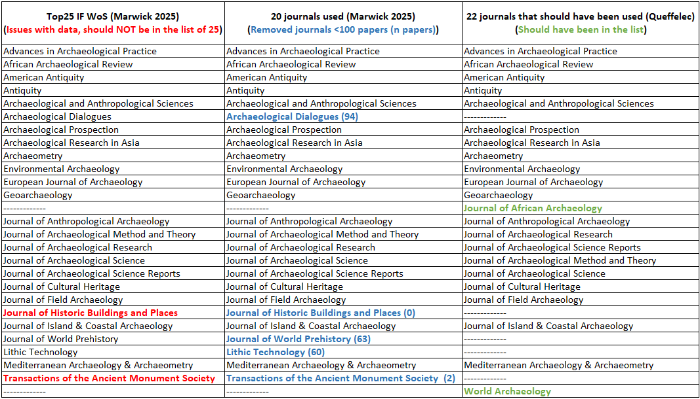
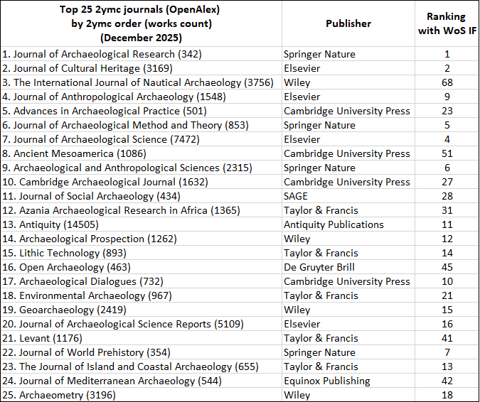
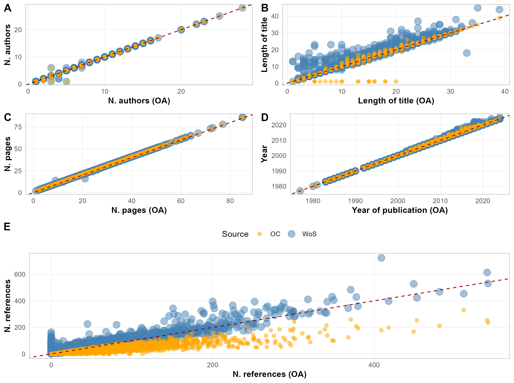
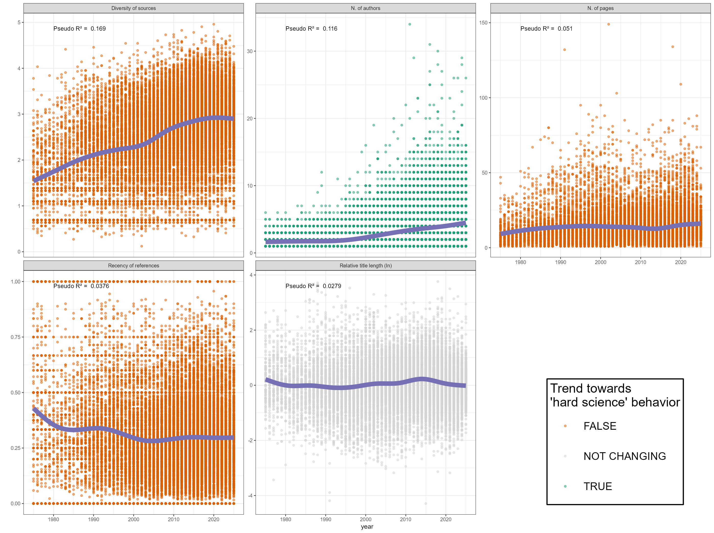
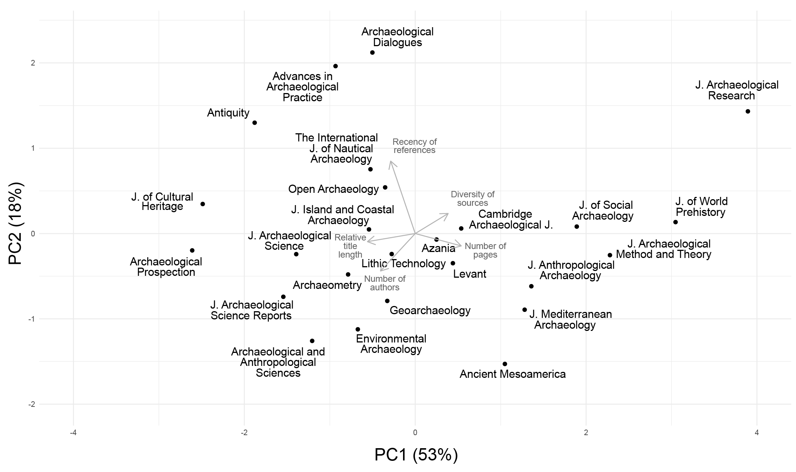

```{r load libraries}
#| output: false
#| cache: false

library(openalexR)
library(dplyr)
library(ggplot2)
library(jsonlite)
library(tools)
library(stringr)
library(purrr)
library(tidyr)
library(broom)
library(cowplot)
library(tidyverse)
library(httr)
library(jsonlite)
library(knitr)
library(kableExtra)
```

\newpage

# Introduction

Replication and reproduction of archaeological studies are extremely rare. Aren't they supposed, though, to be among the pillars of the scientific method [@popper_logic_1959]?

Following the recommendations by @barba_terminologies_2018 and the @nationalacademiesofsciences_reproducibility_2019 which are adopted by @marwick_how_2020 or @karoune_removing_2022, reproduction is defined as "*re-creating the results*" given that "*authors provide all the necessary data and the computer codes to run the analysis again*", while replication is defined as "*arriv*[ing] *at the same scientific findings as another study, collecting new data (possibly with different methods) and completing new analyses*". The former is also called "exact replication" and the later "direct replication" in the EDCR taxonomy summarized by @matarese_kinds_2022. Bibliometric research for any of these two words "reproduction" or "replication" along with the word "archaeology" in Google Scholar and OpenAlex did not yield any result of research articles replicating or reproducing another archaeological article. Published articles clearly emphasizing their aim at being a reproduction or replication of published results is still absent from the literature, even if some articles can contain such reproduction studies [e.g. @foecke_no_2025] and other evaluate the inter-observer errors at the stage of data acquisition, mainly through blind tests [e.g. @kot_reliability_2025; @atici_other_2013; @pargeter_replicability_2023]. Despite the accelerating use of programming languages in archaeological articles [@schmidt_tooldriven_2020] and the growing awareness of reproducibility issues within the community as seen with the advent of "Associate Editors for Reproducibility" in some journals [@farahani_reproducibility_2024; @marwick_archaeology_2025], replicability has yet to be embraced in archaeology [@marwick_three_2022; @karoune_removing_2022]. Despite the article by @marwick_archaeology_2025 being a scientometric study about archaeology rather than an archaeological study, this manuscript attempts to reproduce and replicate the results published in the first part of his article regarding the hard/soft science categorization of publication practice in archaeology (sections 2 and 3). In the second part of his article (sections 4-7), Marwick explains the importance of reproducibility in science, his work as ‘Associate Editor for Reproducibility’ for the first year in the *Journal of Archaeological Sciences*, and proposes ways to improve reproducibility in archaeological studies. I hope in the near future more articles of replications and reproductions of archaeological studies will be published, and that the reproducibility of archaeological articles will be enhanced following the advice provided in his article.

This document will use Marwick's shared code and data to reproduce the results presented in the sections 2 and 3 of the article. This process, originally thought as a personal opportunity for me to learn new aspects of R, Quarto documents, the organization of files in such a research project, and to gain experience with software forges, also served as a means to verify the presented results. 

Delving into the data during the manuscript reproduction, the idea to replicate Marwick's result using OpenAlex occurred to me. I was indeed surprised to read in the article that there were so few archaeological journals with 100 papers in the Web of Science (WoS) database that @marwick_archaeology_2025 had to limit his analysis to just 20 journals. It is also striking that the commercial database of WoS only includes 108 journals in its Archaeology category. The replication section of this document will thus apply the same methodology as Marwick to different but supposedly equivalent and broader dataset, using mainly OpenAlex instead of Web of Science, and also OpenCitations. As open-source projects, OpenAlex and OpenCitations provide free access to bibliometric data for researchers and institutions worldwide, unless the commercial databases such as Web of Science and Scopus [@peroni_opencitations_2020; @priem_openalex_2022]. It is therefore crucial to determine whether OpenAlex can yield comparable results to evaluate research openly [@rizzetto_mapping_2023], especially now that many research institutions have decided to stop relying on the commercial databases [e.g. @cnrs_cnrs_2025; @cnrs_cnrs_2024; @universityofjyvaskyla_subscription_2025; @westvirginiauniversity_wvu_2025; @utrechtuniversity_reminder_2025;  @vrijeuniversiteitamsterdam_termination_2025]. Additionally, it is important to evaluate whether OpenAlex — being a more inclusive database, less biased toward English-language publications and experimental sciences — can broaden the scope of scientometric research [@alperin_analysis_2024, @andersen_fieldlevel_2023]. This replication will assess two key aspects. First, does OpenAlex offer sufficient data for researchers to replicate the analyses conducted by @marwick_archaeology_2025? Second, if so, do the results produced align closely enough that their interpretation would remain consistent?

The core purpose of this article is not to confirm or refute whether archaeology is a hard or soft science based on bibliometric proxies. Instead, it focuses on assessing whether 1) the original study is reproducible from a computational standpoint and 2) whether its findings can be replicated using a different (and open) data source.

# Reproduction of Marwick (2025) {#sec-reproduction}

@marwick_archaeology_2025, in its sections 2 and 3, apply to the archaeological literature a methodology proposed by @fanelli_bibliometric_2013. The goal of this method is to evaluate the position of different disciplines on a hard/soft science scale based on bibliometric proxies. These indices are supposed to organize the disciplines based on their scientific publications, "with papers at the softer end of the spectrum tending to have fewer co-authors, use less substantive titles, have longer texts, cite older literature, and have a higher diversity of sources" [@marwick_archaeology_2025]. This purely bibliometric analysis and the classification of sciences as hard or soft are, of course, debatable, but this is not the purpose of this document.

To compare archaeology with other disciplines with this methodology, the workflow followed by @marwick_archaeology_2025 is:

1. download data from Web of Science for "Archaeology" category,

2. extract and organize useful variables from Web of Science dataset (authors, title, journal, number of pages, year etc.),

3. filter the articles for the top 25 h-indices journals and then for journals with at least 100 published papers, 

4. calculate the indices necessary to compare with other disciplines (number of authors, relative title length, number of pages, age of references (Price's index), diversity of references (Shannon's index),

5. plot indices calculated for archaeology with indices for physics and social sciences by simulating the data to reproduce boxplots visible in @fanelli_bibliometric_2013,

6. plot the evolution of the indices overtime,

7. compare the different journals for each indices and with a multivariate analysis.

**@marwick_archaeology_2025, by providing a well organized code and data organization, allows a complete computational reproduction.**

Nevertheless, reading carefully the article and the code to reproduce it, I identified some concerns with the published version of the manuscript which I will outline here:

-   The manuscript states on page 2 that the selection of the "*top-ranking 25 journals* \[in WoS archaeological was made based on\] *their h-indices as reported by Clarivate’s Journal Citation Indicator*". However, the code of the Quarto document and the dataset itself does not mention H-indices; the filter is actually based on the 2022 Impact Factor of the journals. This is an error in the text of the manuscript, almost a typo, since it does not change anything to the results, but ultimately, the only way to realize that the list of journals is based on the 2022 Impact Factor and not H-indices is by examining the data and code.

-   The dataset of WoS's Impact Factor contains one "\< 0.1" and one "NA" values which integrates the top 25 lines of the dataset when it is arranged in descending order based on this variable. When the values of these two journals's IF are changed to 0, the list of the 25 journals should have included *Journal of African Archaeology* and *World Archaeology* [@tbl-top25Marwick]. Both journals would have maet the criteria for the final list of journals even after applying the threshold of at least 100 papers in WoS, therefore extending this list to include 22 journals.

-   The Shannon's index is incorrecly calculated in Marwick's code and, therefore, should not be compared with the data presented in @fanelli_bibliometric_2013. Although it is accurately described in the comments of the code, the code itself incorrectly computes the Shannon index of the references instead of the sources. Specifically, it divides p_i, the number of times a reference appears in an article (which is always one, as each reference is listed only once in each article), by the total number of citations of that reference in the entire dataset. Instead, it should calculate the Shannon index of the sources of the references. Additionally, the text of the manuscript is also misleading as it mentions "*The diversity of references*" where it should be "The diversity of sources", as presented in @fanelli_bibliometric_2013.

-   The shared code does not contain the code to produce Figure 2 of the manuscript. Version 1.3 of the code loads a pre-existing .png from the figures folder. The code to produce a very similar figure is present in the version 1.1 of the code, but it is not exactly the same.

Other issues are small code errors, which I mentioned by pushing a commit to the GitHub repository of the original article.

{#tbl-top25Marwick}

# Replication of the bibliometric study with data from OpenAlex and OpenCitations

After reproducing the published results, I realized that the Web of Science data for archaeology was limited. Marwick had to integrate the full dataset for archaeology, from 1975 to 2025, to obtain a sufficient amount of articles (9697) because keeping only the year 2012, as in @fanelli_bibliometric_2013, would have led to run the analysis on only 303 articles. He also had to restrict the analysis to just 20 journals to keep journals with at least 100 published articles. With this in mind and the fact that WoS data is not accessible to everyone due to its commercial status, I decided to conduct the same analysis using the larger, open-source dataset provided by OpenAlex [@priem_openalex_2022], and also data from OpenCitations [@peroni_opencitations_2020]. This approach would allow me to determine whether similar results could be obtained with a more extensive dataset and whether freely accessible data could support the same type of research.

OpenAlex, as described on the website of its creator, the nonprofit company OurResearch, is an "*open and comprehensive catalog of scholarly papers, authors, institutions, and more*". Established in 2021, it is a free, open source, and open access bibliographic database that can serve as an alternative to commercial databases and is already supported by many public institutions [e.g. @badolato_partenariat_2024; @jack_sorbonnes_2023; @singhchawla_massive_2022; @ourresearchteam_open_2021]. The OpenAlex database has a much broader scope than Web of Science and its dataset is significantly larger [@culbert_reference_2025; @alperin_analysis_2024]. This can be particularly crucial for archaeology, as the vast majority of references cited in publications from the History & Archaeology field (from OECD classification) are not identifiable in WoS [fig. 5 @andersen_fieldlevel_2023]. However, caution must be exercised with the OpenAlex dataset, as some metadata are still relatively poorly documented [@alperin_analysis_2024]. This will necessitate additional filtering in the OpenAlex dataset to focus on usable data rather than the entire dataset.

OpenCitations is "*an infrastructure organization* [...] *dedicated to the publication of open citation data* [...]*, thereby providing a disruptive alternative to traditional proprietary citation indexes.*" [@peroni_opencitations_2020]. It provides the connections between scientific publications, and a limited number of information on each of the works, but not alike OpenAlex. For example, there is no information on scientific field of the works, it is not possible to filter the publications from a journal of by an author etc. The data from OpenCitations will be used in this work only on the subset of articles which are registered in both OpenAlex and the Web of Science dataset provided by @marwick_archaeology_2025 for direct comparison of some of the bibliometric indices accessible in the three datasets.

## Data extraction from OpenAlex

### Journals' data extraction

To extract data from journals (and from works in the next section) , I used openalexR which is "*an R package to interface with the OpenAlex API*" [@aria_openalexr_2024].

Unfortunately, obtaining all the journals from a subfield of OpenAlex is not feasible, as 'journals' are not categorized by fields or subfields in OpenAlex, unlike 'works' (OpenAlex uses the term 'work' to encompass all types of scientific production).

Consequently, I utilized the list of archaeological journals from Web of Science to retrieve the journal's information from OpenAlex, as this list probably contains the largest journals which will be included in a top 25 list.

```{r Get data of WoS list of journals in OpenAlex (AQ)}
#| output: false

# list of journals from Marwick's WoS list for all the 108 Archaeology journal in WoS
journals_marwick = c("JOURNAL OF CULTURAL HERITAGE","AMERICAN ANTIQUITY","JOURNAL OF ARCHAEOLOGICAL SCIENCE","JOURNAL OF ARCHAEOLOGICAL METHOD AND THEORY","Archaeological and Anthropological Sciences","JOURNAL OF FIELD ARCHAEOLOGY","JOURNAL OF ANTHROPOLOGICAL ARCHAEOLOGY","Archaeological Dialogues","ANTIQUITY","Archaeological Prospection","The Journal of Island and Coastal Archaeology","Lithic Technology","GEOARCHAEOLOGY","Journal of Archaeological Science Reports","African Archaeological Review","JOURNAL OF ARCHAEOLOGICAL RESEARCH","ARCHAEOMETRY","Archaeological Research in Asia","European Journal of Archaeology","Mediterranean Archaeology & Archaeometry","ENVIRONMENTAL ARCHAEOLOGY","Advances in Archaeological Practice","Journal of African Archaeology","WORLD ARCHAEOLOGY","Anatolian Studies","CAMBRIDGE ARCHAEOLOGICAL JOURNAL","JOURNAL OF SOCIAL ARCHAEOLOGY","AMERICAN JOURNAL OF ARCHAEOLOGY","Trabajos de Prehistoria","Azania-Archaeological Research in Africa","AUSTRALIAN ARCHAEOLOGY","ARCHAEOLOGY IN OCEANIA","JOURNAL OF MATERIAL CULTURE","LATIN AMERICAN ANTIQUITY","Rock Art Research","Levant","Journal of Mediterranean Archaeology","International Journal of Historical Archaeology","Open Archaeology","Bulletin of the American Schools of Oriental Research","STUDIES IN CONSERVATION","HISTORICAL ARCHAEOLOGY","ACTA ARCHAEOLOGICA","Ancient Mesoamerica","Oxford Journal of Archaeology","Asian Perspectives-The Journal of Archaeology for Asia and the Pacific","NEAR EASTERN ARCHAEOLOGY","Journal of Roman Archaeology","Medieval Archaeology","Palestine Exploration Quarterly","JOURNAL OF NEAR EASTERN STUDIES","Norwegian Archaeological Review","Praehistorische Zeitschrift","Journal of Maritime Archaeology","Archeologicke Rozhledy","Archivo Espanol de Arqueologia","Journal of the British Archaeological Association","ZEITSCHRIFT DES DEUTSCHEN PALASTINA-VEREINS","Estudios Atacamenos","Arheoloski Vestnik","ARCHAEOFAUNA","Britannia","Complutum","ANTHROPOZOOLOGICA","Zeitschrift fur Assyriologie und Vorderasiatische Archaologie","Industrial Archaeology Review","NORTH AMERICAN ARCHAEOLOGIST","Arqueologia","Post-Medieval Archaeology","JOURNAL OF EGYPTIAN ARCHAEOLOGY","OLBA","Conservation and Management of Archaeological Sites","Boletin del Museo Chileno de Arte Precolombino","Public Archaeology","Belleten","Akkadica","Archaologisches Korrespondenzblatt","Adalya","Vjesnik za arheologiju i povijest dalmatinsku","Aula Orientalis","BULLETIN MONUMENTAL","ZEITSCHRIFT FUR AGYPTISCHE SPRACHE UND ALTERTUMSKUNDE","TRANSACTIONS OF THE ANCIENT MONUMENTS SOCIETY","JOURNAL OF WORLD PREHISTORY","INTERNATIONAL JOURNAL OF OSTEOARCHAEOLOGY","Estonian Journal of Archaeology","ARCHAEOLOGY","Journal of Historic Buildings and Places","Arabian archaeology and epigraphy","Archaeological Reports","Archaeologies","Archäologisches Korrespondenzblatt","Archeologické rozhledy","ArchéoSciences","Archivo Español de Arqueología","Arheološki vestnik","Arqueología","Asian perspectives","Aula orientalis: revista de estudios del Próximo Oriente Antiguo","Azania Archaeological Research in Africa","Boletín del Museo Chileno de Arte Precolombino","Fornvännen","Hesperia The Journal of the American School of Classical Studies at Athens","Intersecciones en antropología","Iran","Israel exploration journal","Mediterranean Archaeology & Archaeometry. International Journal/Mediterranean archaeology and archaeometry. International scientific journal","Opuscula Annual of the Swedish Institutes at Athens and Rome",
"Památky archeologické","Rossiiskaia arkheologiia","Tel Aviv","The Annual of the British School at Athens","The Bulletin of the American Society of Papyrologists","The International Journal of Nautical Archaeology","The journal of egyptian archaeology","The Journal of Island and Coastal Archaeology","The Journal of Juristic Papyrology","The South African Archaeological Bulletin","Time and Mind","Trabajos de Prehistoria","Transactions of The Ancient Monuments Society","Vjesnik za arheologiju i povijest dalmatinsku","Zeitschrift des Deutschen Palästina-Vereins","Zeitschrift für Ägyptische Sprache und Altertumskunde","Zeitschrift für Assyriologie und Vorderasiatische Archäologie","Zephyrvs")

journals_marwick <- toTitleCase(tolower(journals_marwick))

sources_extract <- oa_fetch(
  entity = "sources",
  display_name = journals_marwick,
  type = "Journal",
  count_only = FALSE,
  options = list(sort = "display_name:desc"),
  verbose = TRUE
)

sources_extract %>% distinct(display_name, .keep_all = TRUE)

Journal_metrics = sources_extract$summary_stats
h_index <- as.numeric(sapply(Journal_metrics, function(x) x[2]))
twoyr_mean_citedness <- round(as.numeric(sapply(Journal_metrics, function(x) x[1])),2)
i10 <- as.numeric(sapply(Journal_metrics, function(x) x[3]))

id_all = sources_extract$id 
sources_extract$id = gsub('https://openalex.org/', '' ,sources_extract$id)

sources_extract_simple <- sources_extract %>%
  mutate(twoyr_mean_citedness = twoyr_mean_citedness, h_index = h_index, i10 = i10, OpenAlex_id = id) %>%
  distinct(display_name, .keep_all = TRUE) %>%
  arrange(`display_name`)

sources_extract_simple <- sources_extract_simple %>% select(display_name, host_organization_name, works_count, cited_by_count, twoyr_mean_citedness, h_index, i10, OpenAlex_id)

jci_top_25_2ymc <- 
  sources_extract_simple %>% 
  arrange(desc(`twoyr_mean_citedness`)) %>%
  slice(c(1,3:26)) # take the top 26 without Archaeofauna, see text 

id_25_2ymc = gsub("https://openalex.org/","",jci_top_25_2ymc$OpenAlex_id)

jci_top_25_hindex <- 
  sources_extract_simple %>% 
  arrange(desc(`h_index`)) %>% 
  slice(1:25)

jci_top_25_i10 <- 
  sources_extract_simple %>% 
  arrange(desc(`i10`)) %>%
  slice(1:25)
```

While requesting OpenAlex with the list of 108 journals from WoS, I received only 38 results. This is due to variations in journal names, such as the use of capitals letters, dashes, etc. When I adjusted manually the names to match those in OpenAlex for the journals which are further used in Marwick's top 25 and top 20 lists, I received 69 results, including all the journals from these lists.

To gather information from OpenAlex for as many journals as possible, I had to check each journal individually with his name or sometimes its ISSN. This was necessary because special characters from journal names have been removed in the WoS dataset, many journals which title begins with "The" are in the WoS dataset without the "The", among similar issues. For example in WoS a journal is called 'Hesperia' when it is called 'Hesperia The Journal of the American School of Classical Studies at Athens' in OpenAlex. Unfortunately, this task of extracting journals is not straightforward, and it would be much more efficient that the journals in OpenAlex have also fields and subfields to gather the information in a single request. Ultimately, I successfully retrieved data through openalexR and the API for 85 out of the 108 journals listed in WoS. However, increasing the count from 69 to 85 did not alter the top 25, and the still missing journals likely would not have been in the top 25 either, given that they are not major journals.

### Articles' data extraction

#### Using the API via web browser

I attempted to download all articles from OpenAlex in the subfield of Archaeology (number 1204) by accessing the API through an internet browser at this address: <https://api.openalex.org/works?filter=type:article,from_publication_date:1975-01-01,to_publication_date:2025-12-31,topics.subfield.id:1204>. This results in a gigantic list of more than 1.8 million references that can only be viewed 25 entries at a time. If you download it as JSON files, it is only by a single page of the first 25 or at best 100 results. This is not feasible manually. For such large queries, the OpenAlex team recommends downloading their full dataset, a 300 GB JSON file. However, I didn't try this way because of my lack of experience in manipulating large JSON files.

#### Using the openalexR package

```{r Counting papers Archaeology in OpenAlex (AQ)}
#| label: Count works from OpenAlex through API

# Here we just count the number of articles in the subfield Archaeology 
works_search_count <- oa_fetch(
  entity = "works",
  #type = "article",
  topics.subfield.id = "1204", # 1204 is the id of the subfield Archaeology
  count_only = TRUE,
  output = "dataframe",
  from_publication_date = "1975-01-01",
  to_publication_date = "2025-12-31",
  verbose = TRUE
)

# Here we just count the number of articles in the subfield Archaeology 
articles_search_count <- oa_fetch(
  entity = "works",
  type = "article",
  topics.subfield.id = "1204", # 1204 is the id of the subfield Archaeology
  count_only = TRUE,
  output = "dataframe",
  from_publication_date = "1975-01-01",
  to_publication_date = "2025-12-31",
  verbose = TRUE
)
```

```{r Load all papers Archaeology short}
#| eval: false

works_archaeology_short_1975_2025 <- readRDS("data/OpenAlex_works_archaeology_short_1975_2025.rds")

# Keeping only the articles from the OpenAlex top25 2-year mean citedness journals
works_archaeology_top25_1975_2025 <- works_archaeology_short_1975_2025 %>% filter(source_display_name %in% jci_top_25_2ymc$display_name)
```

When requesting works with *openalexR*, it is possible to use an entire subfield ID, in this case '1204' for 'Archaeology'. Simply counting the number of articles in the subfield Archaeology in OpenAlex between 1975 and 2025 yields a result of `r works_search_count[1]`. Given the size of this sample, I downloaded it only once and then simplified it to keep only necessary fields and cleaned it for doublons. I then saved this data in case I would use it later, and I also extracted a subset from this enormous dataset keeping only the articles from the top 25 journals based on their 2-years-mean-citedness. This subset contains 20551 articles.

To replicate Marwick's work, I also directly extracted from OpenAlex the metadata of all the articles published in the same list of journals. It is very interesting to observe that this extraction leads to a dataset of 33395 after cleaning, much bigger than the previous subset. This is due to the fact that many articles from these journals are not classified with the subfield 'Archaeology' but with 'Anthropology', 'Geophysics', 'Classics', 'History' etc. A very telling example is to compare the number of articles published in the journal *Advances in Archaeological Practice* in 2025 based on OpenAlex, which is 43, with the number of articles with the subfield 'Archaeology' in this same journal for this same year, which is 5. For the sake of replication of Marwick's article, I kept the dataset containing all the articles published in the top-25 journals for the rest of this article.

To this articles metadata, I added the metadata from the cited papers for each article. This step required approximately 20 hours, as it requires submitting an individual API request for each article, and the duration of each request is variable as the amount of information to retrieve depends on the number of references in the article. The data extracted this way contains many inconsistency, errors, special characters etc. and I had to clean and filter it, as visible in the code used to produce this document.

Despite the availability of other journal-level metrics such as H-index and i10 in OpenAlex, data was not extracted, and the graphics not produced, for the top 25 journals based on them. This is because these metrics are strongly correlated with the seniority of the journals, similar to when these metrics are used to compare individual researchers [@hirsch_index_2005;  @kozak_new_2012].

```{r load, clean, prepare data from OpenAlex (AQ)}

# Load the .rds files created by 2 time consuming chunks of code run in the Quarto document Long_requests.qmd: 
# 1) "Downloading OpenAlex works from top25 2ymc journals (AQ)" (several minutes) 
# 2) "get year and journals of refs through OpenAlex API (AQ)" (20+ hours)

items_df <- readRDS("data/OpenAlex_Works_top25_1975_2025.rds")
year_refs_list = readRDS("data/year_refs_list.rds")
journal_refs_list = readRDS("data/journal_refs_list.rds")
year_refs_list[[45332]] = ""
journal_refs_list[[45332]] = ""

# Simplify the journal names so that there is no more points, commas etc. 
journal_refs_list <- lapply(journal_refs_list, function(x) gsub("[^a-zA-Z]", "", x))
journal_refs_list <- lapply(journal_refs_list, function(x) gsub("[\\(]", "", x))

# Add the year_refs and journal_refs to items_df
for (i in 1:nrow(items_df)){
items_df$year_refs[i] = paste(year_refs_list[[i]], collapse = ", ")
items_df$journal_refs[i] = paste(journal_refs_list[[i]], collapse = ", ")
}

# Get the OpenAlex IDs alone for each ref and split 
items_df = items_df  %>% 
  mutate(refs = str_remove_all(refs, "https://openalex.org/")) %>%
  mutate(refs = str_remove(refs, "^c\\(")) %>%
  mutate(refs = str_remove_all(refs, '"')) %>%
  mutate(refs = str_remove_all(refs, '\\)')) %>%
  mutate(refs = str_remove_all(refs, '\n')) %>% 
  mutate(journal_refs = str_replace_all(journal_refs, 'MedicalEntomologyandZoology, ', 'NA, ')) %>% # Replace the OpenAlex errors of attribution of the refs to this japanese database by NA so that it is treated in the next steps of the code accordingly.
  mutate(journal_refs = str_remove_all(journal_refs, " ,")) %>% # Remove the empty values for sources
  filter(!str_detect(title, "isbn"))  %>% # Remove the book reviews which have isbn in their title
  filter(!str_detect(title, "hardback"))  %>% # Remove the book reviews which have hardback in their title
  filter(!str_detect(title, "paperback")) # Remove the book reviews which have paperback in their title

# Fill the refs and journal_refs so that their length does match because sometimes it doesn't due to some absence in OpenAlex dataset and for further steps it is necessary that they match

length_journal_refs <- lapply(items_df$journal_refs, function(x) {
  split_result <- strsplit(x, ", ")[[1]]
  if (length(split_result) == 1 && split_result[1] == "") {0} 
  else {length(split_result)}})

items_df$length_journal_refs = length_journal_refs
items_df$refs_mod = items_df$refs
items_df$journal_refs_mod = items_df$journal_refs

generate_unique_false_ref <- function() {
  paste0("R", paste0(sample(0:9, 10, replace = TRUE), collapse = ""))
} # generate false OpenAlex IDs beginning with an R for Reference instead of W so that we can detect them
generate_unique_false_journal <- function() {
  paste0("J", paste0(sample(0:9, 10, replace = TRUE), collapse = ""))
} # generate false OpenAlex IDs beginning with an J for Journal so that we can detect them

for (i in 1:nrow(items_df)) {
    len_diff = items_df$refs_n[[i]] - items_df$length_journal_refs[[i]]
    if (len_diff != 0) {  
      if (len_diff > 0 & items_df$length_journal_refs[i] > 0) {
        # Create false unique journals if necessary
        false_journals <- tibble(replicate(len_diff, generate_unique_false_journal()))
        items_df$journal_refs_mod[i] <- rbind(items_df$journal_refs_mod[i], false_journals)
      } else if (len_diff < 0) {
        # Create false unique refs if necessary
        false_refs <- replicate(abs(len_diff), generate_unique_false_ref())
        items_df$refs_mod[i] <- rbind(items_df$refs_mod[i], false_refs)
      } else {
        false_journals <- tibble(replicate(len_diff, generate_unique_false_journal()))
        false_refs <- replicate(abs(len_diff), generate_unique_false_ref())
        items_df$journal_refs_mod[i] <- false_journals
        items_df$refs_mod[i] <- false_refs
      }
    }
}

items_df = items_df  %>% 
  mutate(journal_refs_mod = str_remove(journal_refs_mod, "^c\\(")) %>%
  mutate(journal_refs_mod = str_remove_all(journal_refs_mod, '"')) %>%
  mutate(journal_refs_mod = str_remove_all(journal_refs_mod, '\\)')) %>%
  mutate(journal_refs_mod = str_remove_all(journal_refs_mod, ' ,'))

items_df = items_df %>% filter(title_n !=0,
                               pages_n > 0,
                               pages_n != 0,
                               pages_n < 1000,
                               authors_n > 0)
```

```{r preparing clean list of refs per article (AQ)}
# simplify the refs, since they are a bit inconsistent, some of
# these steps take a few seconds
ref_list1 <- map(items_df$journal_refs_mod, ~tolower(.x))
ref_list2 <- map(ref_list1, ~str_split(.x, ", "))
ref_list3 <- map(ref_list2, ~tibble(x = .x))
ref_list4 <- bind_rows(ref_list3, .id = "id")
refs_mod <- tibble(refs_mod = str_split(items_df$refs_mod, ", ")) 
ref_list5 <- cbind(ref_list4, refs_mod)
ref_list6 <- unnest(ref_list5, cols = c(x,refs_mod)) %>% 
  filter(!str_detect(refs_mod, "^R\\d{10}$"))

ref_list7 <- 
  ref_list6 %>% 
  rename(journal_name = x, x = refs_mod) %>%
  filter(x != "W4285719527") %>%
  filter(!journal_name %in% c("choicereviewsonline","pubmed","hallecentrepourlacommunicationscientifiquedirecte","doajdoajdirectoryofopenaccessjournals")) %>%
  filter(!str_detect(journal_name, "books"))

ref_list_journals <- ref_list7[,c(1,2)] %>% filter(!journal_name %in% c("na"))
ref_list_works <- ref_list7[,c(1,3)] %>% filter(!x %in% c("NA"))
```

```{r exporting works with 0, 1, and 2 refs to check (AQ)}
#| eval: false

# Apply the function
few_refs <- table(items_df$refs_n)[c("0", "1", "2")]
```

## Comparison between WoS and OpenAlex

### Journals' comparison {#sec-compa_journals_lists}

#### General comparison of archaeological journals in both databases

The fact that there are only 108 journals in the archaeology category of the Web of Science database, is unfortunately difficult to compare directly with OpenAlex since it is not possible to extract all the journals of the subfield 'Archaeology' form the open database. I therefore filtered the OpenAlex dataset of all articles published between 1975 and 2025 with the subfield 'Archaeology' (ca. 1,800,000 articles) and grouped them by source. This treatment reveals that 2314 sources are registered in OpenAlex with at least 100 articles with the subfield 'Archaeology', including some data repository or public archives such as Zenodo, HAL etc. The same treatment for a limit of 500 and 1000 articles gives a result of 337 and 122 sources respectively. This difference is certainly at least partly due to the fact that being indexed in WoS necessitate application by the journal and a validation by Clarivate, the company owning WoS.

Once the journals' information are extracted from OpenAlex based on the list of archaeological journals from WoS, it is possible to compare the two datasets at the journal level for 85 out of the 108 journals.

The WoS dataset is limited in terms of papers listed when comparing journals present in both databases. It is interesting to demonstrate this by looking at those journals which have been removed from Marwick's top 25 list because they had less than 100 articles. *Archaeological Dialogues* (94 papers in Wos), *Journal of World Prehistory* (63 papers in WoS), and *Lithic Technology* (60 papers in WoS) have respectively 732, 354, and 893 papers in the OpenAlex database. I do not know why the WoS dataset is so small even for journals which are in the list.

The metadata of both datasets are also different. OpenAlex gives much more variables and information on the selected works or journals than WoS. The main issue with both datasets is the lack of many information regarding books, book chapters, monographs, and grey literature, as scientific production recorded in the database and also as references cited in the articles.

While the size of the OpenAlex dataset can be seen as an advantage due to its broader representation of diverse sources, it may also introduce noise, such as poor-quality data or duplicates. Since both datasets have their issues, I cleaned it as much as possible as Marwick did too for his data.

#### Comparison of the top 25 list for both databases

Since both datasets provide the same metric, 2-years-mean-citedness (2ymc) which is the same as Impact Factor, the top 25 journals from WoS can be compared with the top 25 from OpenAlex. It is important to note that this metric is calculated by each database based on their own data. OpenAlex for example does calculate the 2ymc of each journal based solely on the articles that they have in their dataset, and by counting the references that they do have in their dataset which cites each article. OpenAlex does not rely on another source to directly provide the 2ymc of each journal or even to calculate the number of citations of an article: they do use their internal data to calculate this metric. This lead to at least one issue that I was able to spot in the top 25 list of OpenAlex archaeological journals based on the 2ymc, since in the original dataset, the journal *Archaeofauna* rank second with a 2ymc of more than 4, which is very high for such a specialized journal. The value of the 2ymc of *Archaeofauna* is artificially inflating: OpenAlex extracted the number of citations of each paper from 2023 from the pdf of the articles, which all contain the Table of Content of the volume with the doi. Thus, each paper of the volume is considered citing each other paper of the volume, creating numerous false citations. I removed this journal from the top 25 and kept in the list the journal ranked 26th.

Both lists are at the same time similar and pretty different. I can outline here some specific points:

-   As for the WoS list, the 25 journals are English-language journals. They are published by 9 different publishers: Springer Nature, Wiley, Elsevier, Cambridge University Press, SAGE, Taylor & Francis, Antiquity Publications, De Gruyter Brill, and Equinox Publishing.

-   *American Antiquity* is missing from the list because it has a pretty low 2ymc in OpenAlex and is therefore ranked 41st. It is related to the fact that all the book reviews published in this journal are counted as articles in OpenAlex, therefore strongly diminishing the ratio between citations and the number of published articles. If those book reviews would be removed, the 2ymc of *American Antiquity* would be 2.33 instead of 0.83, and would be ranked at 8th position.

-   All the 25 journals have largely more than 100 works in the OpenAlex dataset, so we can keep them all based on Marwick's decision to keep only journals with more than 100 articles for further analysis. The minimum here is 342 works for *Journal of Archaeological Research*.

-   Strong discrepancies (\>15-20) between the 2ymc rankings from OpenAlex and the IF ranking from Web of Science can be detected for 10 journals: *The International Journal of Nautical Archaeology*, *Advances in Archaeological Practice*, *Ancient Mesoamerica*, *Cambridge Archaeological Journal*, *Journal of Social Archaeology*, *Azania Archaeological Research in Africa*, *Open Archaeology*, *Levant*, *Journal of World Prehistory*, and *Journal of Mediterranean Archaeology*. These differences can go in both directions, and show that the calculation of the 2ymc is subject to strong differences between databases. As a reminder, this metric is calculated, for a journal, as the ratio between the number of citations in 2024 of articles published in 2022 and 2023 in the journal, divided by the number of articles published in 2022 and 2023. I think it is possible to interpret these strong differences as issues in the databases about the references, rather than about the number of published articles which is a value much easier to record.

-   The OpenAlex dataset also containing other journal's metrics H-indices and i10, I also made the top25-rankings on these metrics (@tbl-top25OpenAlex). H index defined as the number of papers (h) with citation number ≥ h [@hirsch_index_2005]. The i10 index, created initially by Google Scholar, is the number of articles that have been cited at least 10 times. These rankings are strongly dissimilar with the 2ymc ranking, and are less impacted by recent trends and more representative of long-term publication habits in archaeology and put at the top the historical journals of archaeology.

- The top 25 2ymc journals from OpenAlex in this manuscript is also quite different from the list presented in the previous version of this manuscript (June 2025), and show that these values can change in few months. Some journals are present in this list but were completely absent 6 months ago (e.g. *Ancient Mesoamerica*, *Azania Archaeological Research in Africa*) and despite my rapid check on the data, I did not spot any real reason for that. On the other hand, the top 1 journal 6 months ago in the V3 of this manuscript, *Australian Archaeology*, has disappeared from the list, and I discovered why it was at this position: the journal published a book review of "The Dawn of Everything" [@flexner_dawn_2022] which has 1137 citations in OpenAlex and artificially inflates the 2ymc of this journal. I think that most of these citations should relate to the book reviewed itself and not to this review. Here again, we can see that the references in OpenAlex are not as clean as one could hope.

{#tbl-top25OpenAlex}

#### Comparison of the top-cited journals

The list of the top cited journals from the OpenAlex dataset shows that the most cited journal, *Journal of Archaeological Science*, is more than twice as cited as the second one, *American Antiquity*, and more than three times the third one *Antiquity*. This highligths the importance of this journal in the community and may partly explain the low values of Shannon's index. It is also interesting to note the presence of highly reputable generalist journals in position 5 and 6 for *Nature* and *Science* respectively, and even of the *PNAS* in position 17.

This table of the most cited journals differs significantly from the same table in @marwick_archaeology_2025 (calculated in the code but not shown in the published article). This table ranks *Journal of Archaeological Science* first, followed by *American Antiquity* with half the citations, as with the data from OpenAlex. Starting from the third position, the order changes considerably, with *Antiquity* ranking 3rd and not *Archaeometry* for instance. The journal *Nature* is here in the 15th position, and the *PNAS* in 9th. *Quaternary International* is in 5th position woth WoS dataset, whereas it is 12th in the OpenAlex table, etc. This indicates that the differences between both datasets regarding references are relatively significant, which explains the variations in the Diversity of source results. This discrepancy could be due to the recency of the WoS dataset (70% of the articles are post-2012), as seen for example with the presence of *PLoS ONE* (created in 2006) and *Journal of Archaeological Science: Reports* (created in 2015) in the top 20 sources, despite both journals being relatively new outlets.

```{r tables top 20 journals OpenAlex and WoS (AQ)}

# get a list of the top journals
top_journals <- 
  ref_list_journals %>% 
  select(journal_name) %>% 
  group_by(journal_name) %>% 
  tally() %>% 
  filter(n > 50) %>% 
  arrange(desc(n))

top20_cited_journals = top_journals %>% head(20)
colnames(top20_cited_journals) = c("Journal","N.citations") 
top20_cited_journals = top20_cited_journals %>%
  mutate(rank = seq(1:20))  %>%
  relocate(rank, .before = Journal)

top20_cited_journals_4cols = cbind(top20_cited_journals[1:10,],top20_cited_journals[11:20,])

# get top 20 journals from Marwick
top_cited_journals_marwick = readRDS("data/top_cited_journals_Marwick.rds")

top20_cited_journals_marwick = top_cited_journals_marwick %>% head(20)
colnames(top20_cited_journals_marwick) = c("Journal","N.citations") 
top20_cited_journals_marwick = top20_cited_journals_marwick %>%
  mutate(rank = seq(1:20)) %>%
  relocate(rank, .before = Journal)

top20_cited_journals_marwick_4cols = cbind(top20_cited_journals_marwick[1:10,],top20_cited_journals_marwick[11:20,])
```

```{r table top 20 journals OpenAlex (AQ)}
#| label: tbl-top20journals
#| tbl-cap: "Top 20 journals from OpenAlex dataset"
 
# Display the table
knitr::kable(top20_cited_journals_4cols) #%>%  kable_styling(latex_options = c("striped", "hold_position"), full_width = FALSE) # Need to remove the kable_styling when rendering the .docx file
```

```{r table top 20 journals WoS (AQ)}
#| label: tbl-top20journals_marwick
#| tbl-cap: "Top 20 journals from Web of Science dataset"

# Display the table
knitr::kable(top20_cited_journals_marwick_4cols) #%>% kable_styling(latex_options = c("striped", "hold_position"), full_width = FALSE) # Need to remove the kable_styling when rendering the .docx file
```

### Articles' comparison {#sec-compa_works_lists}

At the level of the articles, I compared the datasets from OpenAlex, Web of Science, and OpenCitations, for three subsets: the total of works in the archaeology field, the total of articles in the same field, the articles present in the top-20 or top-25 journals ranked by their 2ymc, and the articles which are represented in the three datasets based on identical DOIs (@tbl-basicstats). As previously demonstrated at a higher level than just archaeology, the OpenAlex dataset is significantly larger than the Wos dataset [@culbert_reference_2025; @alperin_analysis_2024], at every level.

Only articles from OpenAlex were extracted for this study for the sake of comparison with Marwick's work. This, of course, does not fully represent the scientific production of the discipline. A similar work encompassing all the sources of archaeological publications would be of course even more interesting but is out of the scope of this article.

The WoS dataset of archaeological articles is much smaller than the OpenAlex dataset for the same field: 28 871 compared to 2 050 903. OpenAlex aggregates data from a much wider diversity of sources. However, this number of archaeological articles in OpenAlex is largely underevaluated since many articles published in archaeological journals are not indexed with the subfield 'Archaeology'. I couldn't evaluate the number of references in OpenCitations for a specific field. The number of articles kept for the analysis in this article, which are only from the top-25 journals for OpenAlex and top-20 for WoS, is also much bigger for OpenAlex: 33 395 vs. 9 697. The WoS dataset also shows a bias towards more ancient articles (Wilcoxon test p << 0.01), when OpenAlex integrates much more recent articles and also older ones (@fig-comparison_wos_OA).

As for other basic statistics such as number of authors and pages, @tbl-basicstats shows that the values can be different for different datasets, but the values are very similar when the dataset is kept to articles which are common to all of them. This last subset, based on similar DOIs and therefore for indexed journals only, shows that good metadata is possible to achieve in specific cases. On the other hand, the OpenAlex dataset also shows in archaeology the same limitations regarding some metadata which have been previously demonstrated [@culbert_reference_2025; @alperin_analysis_2024], especially the list of references cited in the articles. I also show here that the Open Citations has even less cited references (@tbl-basicstats).

```{r keeping only articles present in both OpenAlex and WoS datasets AQ}
articles_Wos = readRDS("data/wos-data-df.rds")
articles_OpenAlex = items_df
articles_OpenAlex$doi <- sub("https://doi.org/", "", articles_OpenAlex$doi)

articles_OpenAlex_filtre <- articles_OpenAlex[articles_OpenAlex$doi %in% articles_Wos$doi, ]

colnames(articles_OpenAlex_filtre) <- paste0(colnames(articles_OpenAlex_filtre), "_OA")
colnames(articles_Wos) <- paste0(colnames(articles_Wos), "_WoS")

Common_Articles_limited <- merge(articles_OpenAlex_filtre, articles_Wos, by.x = "doi_OA", by.y = "doi_WoS") 
Common_Articles_limited_short <- Common_Articles_limited %>%
  select(-authors_OA, -title_OA, -journal_OA, -abstract_OA, -refs_OA, -authors_WoS, -title_WoS, -journal_WoS, -abstract_WoS, -refs_WoS, -refs_OA)

# Correcting a single error in OpenAlex which makes an outlier preventing reading the plot (the length of the article is 326 in Taylor & Francis metadata but checking the pdf of the real article, it should be 27, as recorded in WoS)

Common_Articles_limited_short <- Common_Articles_limited_short %>%
  mutate(pages_n_OA = replace(pages_n_OA, pages_n_OA == 326, 27))
```

```{r plotting comparison Wos OpenCitations OpenAlex (AQ)}

# Load the .rds files created by the 2 time consuming chunks of code run in the Quarto document Long_requests.qmd: 
# 1) "extracting number of references from OpenCitations for articles in OpenAlex and WoS (AQ)" 
# 2) "extracting informations from OpenCitations for articles in both OpenAlex and WoS (AQ)"

refs_OpenCitations = readRDS("data/refs_OpenCitations.rds")
infos_OpenCitations = readRDS("data/infos_OpenCitations.rds")

# Keeping only doi which are in OpenAlex and WoS and OpenCitations
refs_OpenCitations = refs_OpenCitations %>%
  filter(refs_OpenCitations$doi %in% infos_OpenCitations$doi_OC)

infos_OpenCitations = infos_OpenCitations %>%
  filter(infos_OpenCitations$doi_OC %in% refs_OpenCitations$doi)

Common_Articles_limited_short <- Common_Articles_limited_short %>%
  filter(Common_Articles_limited_short$doi_OA %in% infos_OpenCitations$doi_OC)

Common_Articles_limited_short$refs_n_OC = refs_OpenCitations$refs_n_OC
Common_Articles_limited_short$pages_n_OC = infos_OpenCitations$pages_n_OC
Common_Articles_limited_short$year_OC = infos_OpenCitations$year_OC
Common_Articles_limited_short$authors_n_OC = infos_OpenCitations$authors_n_OC
Common_Articles_limited_short$title_n_OC = infos_OpenCitations$title_n_OC

# preparing data for combined plot
data_refs_OA_WoS_OC <- bind_rows(
  mutate(Common_Articles_limited_short, source = "WoS", refs_n = refs_n_WoS),
  mutate(Common_Articles_limited_short, source = "OC", refs_n = refs_n_OC)
) %>%
  select(refs_n_OA, source, refs_n)

data_pages_OA_WoS_OC <- bind_rows(
  mutate(Common_Articles_limited_short, source = "WoS", pages_n = pages_n_WoS),
  mutate(Common_Articles_limited_short, source = "OC", pages_n = pages_n_OC)
) %>%
  select(pages_n_OA, source, pages_n)

data_year_OA_WoS_OC <- bind_rows(
  mutate(Common_Articles_limited_short, source = "WoS", year = year_WoS),
  mutate(Common_Articles_limited_short, source = "OC", year = year_OC)
) %>%
  select(year_OA, source, year)

data_authors_OA_WoS_OC <- bind_rows(
  mutate(Common_Articles_limited_short, source = "WoS", authors_n = authors_n_WoS),
  mutate(Common_Articles_limited_short, source = "OC", authors_n = authors_n_OC)
) %>%
  select(authors_n_OA, source, authors_n)

data_title_OA_WoS_OC <- bind_rows(
  mutate(Common_Articles_limited_short, source = "WoS", title_n = title_n_WoS),
  mutate(Common_Articles_limited_short, source = "OC", title_n = title_n_OC)
) %>%
  select(title_n_OA, source, title_n)

# Create function for biplots
create_combined_biplot <- function(data, var1, var2, source) {
  ggplot(data, aes_string(x = var1, y = var2, color = source)) +
    geom_point(aes(size = source),alpha = 0.5) +
    scale_size_manual(
      values = c("WoS" = 4, "OC" = 2), # Taille des points : 3 pour WoS, 1.5 pour OC
      name = "Source"
    ) +
    scale_color_manual(
      values = c("WoS" = "steelblue", "OC" = "orange"),
      name = "Source"
    ) +
    geom_abline(intercept = 0, slope = 1, color = "darkred", linetype = "dashed") +
    labs(x = var1, y = var2, title = NULL) +
    theme_minimal() +
    theme(
      plot.title = element_text(hjust = 0.5, face = "bold"),
      axis.title = element_text(face = "bold"),
      panel.grid.major = element_line(color = "gray90", size = 0.2),
      panel.grid.minor = element_blank(),
      panel.border = element_rect(color = "gray70", fill = NA, size = 0.5),
      legend.position = "top"
    )
}


# Create plots
p_authors_n_OA_WoS_OC <- create_combined_biplot(data_authors_OA_WoS_OC, "authors_n_OA", "authors_n", "source")
p_authors_n_OA_WoS_OC = p_authors_n_OA_WoS_OC + labs(title = NULL) + xlab("N. authors (OA)") + ylab("N. authors") + theme(legend.position = "none")

p_title_n_OA_WoS_OC <- create_combined_biplot(data_title_OA_WoS_OC, "title_n_OA", "title_n", "source")
p_title_n_OA_WoS_OC = p_title_n_OA_WoS_OC + labs(title = NULL) + xlab("Length of title (OA)") + ylab("Length of title") + theme(legend.position = "none")

p_pages_n_OA_WoS_OC <- create_combined_biplot(data_pages_OA_WoS_OC, "pages_n_OA", "pages_n", "source")
p_pages_n_OA_WoS_OC = p_pages_n_OA_WoS_OC + labs(title = NULL) + xlab("N. pages (OA)") + ylab("N. pages") + theme(legend.position = "none")

p_year_OA_WoS_OC <- create_combined_biplot(data_year_OA_WoS_OC, "year_OA", "year", "source")
p_year_OA_WoS_OC = p_year_OA_WoS_OC + labs(title = NULL) + xlab("Year of publication (OA)") + ylab("Year") + theme(legend.position = "none")

p_refs_n_OA_WoS_OC <- create_combined_biplot(data_refs_OA_WoS_OC, "refs_n_OA", "refs_n", "source")
p_refs_n_OA_WoS_OC = p_refs_n_OA_WoS_OC + labs(title = NULL) + xlab("N. references (OA)") + ylab("N. references")

# Use cowplot to organize the plots
top_row <- plot_grid(p_authors_n_OA_WoS_OC, p_title_n_OA_WoS_OC, ncol = 2, labels = c("A","B"))
bottom_row <- plot_grid(p_pages_n_OA_WoS_OC, p_year_OA_WoS_OC, ncol = 2, labels = c("C","D"))
final_grid <- plot_grid(top_row, bottom_row, ncol = 1, rel_heights = c(1, 1))
final_grid <- plot_grid(final_grid, p_refs_n_OA_WoS_OC, ncol = 1, rel_heights = c(2, 1.5), labels = c("","E"))

ggsave(final_grid,height = 6.95, width = 9.31,
       filename = ("figures/fig-comparison_wos_OA.png"))
```

```{r Basic stats datasets}

stats_OpenAlex_topjournals <- articles_OpenAlex %>%
  summarise(
    n_articles_topjournals_OA = n(),
    mean_authors_topjournals_OA = mean(authors_n, na.rm = TRUE),
    median_authors_topjournals_OA = median(authors_n, na.rm = TRUE),
    mean_pages_topjournals_OA = mean(pages_n, na.rm = TRUE),
    median_pages_topjournals_OA = median(pages_n, na.rm = TRUE),
    mean_refs_topjournals_OA = mean(refs_n, na.rm = TRUE),
    median_refs_topjournals_OA = median(refs_n, na.rm = TRUE)
  )

stats_WoS_topjournals <- as.data.frame(articles_Wos) %>%
  summarise(
    n_articles_topjournals_WoS = n(),
    mean_authors_topjournals_WoS = mean(authors_n_WoS, na.rm = TRUE),
    median_authors_topjournals_WoS = median(authors_n_WoS, na.rm = TRUE),
    mean_pages_topjournals_WoS = mean(pages_n_WoS, na.rm = TRUE),
    median_pages_topjournals_WoS = median(pages_n_WoS, na.rm = TRUE),
    mean_refs_topjournals_WoS = mean(refs_n_WoS, na.rm = TRUE),
    median_refs_topjournals_WoS = median(refs_n_WoS, na.rm = TRUE)
  )

stats_OpenAlex_common <- Common_Articles_limited_short %>%
  summarise(
    n_articles_common_OA = n(),
    mean_authors_common_OA = mean(authors_n_OA, na.rm = TRUE),
    median_authors_common_OA = median(authors_n_OA, na.rm = TRUE),
    mean_pages_common_OA = mean(pages_n_OA, na.rm = TRUE),
    median_pages_common_OA = median(pages_n_OA, na.rm = TRUE),
    mean_refs_common_OA = mean(refs_n_OA, na.rm = TRUE),
    median_refs_common_OA = median(refs_n_OA, na.rm = TRUE)
  )

stats_Wos_common <- Common_Articles_limited_short %>%
  summarise(
    n_articles_common_WoS = n(),
    mean_authors_common_WoS = mean(authors_n_WoS, na.rm = TRUE),
    median_authors_common_WoS = median(authors_n_WoS, na.rm = TRUE),
    mean_pages_common_WoS = mean(pages_n_WoS, na.rm = TRUE),
    median_pages_common_WoS = median(pages_n_WoS, na.rm = TRUE),
    mean_refs_common_WoS = mean(refs_n_WoS, na.rm = TRUE),
    median_refs_common_WoS = median(refs_n_WoS, na.rm = TRUE)
  )

stats_OpenCitations_common <- cbind(
  infos_OpenCitations %>%
  summarise(
    n_articles_common_OC = n(),
    mean_authors_common_OC = mean(authors_n_OC, na.rm = TRUE),
    median_authors_common_OC = median(authors_n_OC, na.rm = TRUE),
    mean_pages_common_OC = mean(pages_n_OC, na.rm = TRUE),
    median_pages_common_OC = median(pages_n_OC, na.rm = TRUE)
  ),
  refs_OpenCitations %>%
    summarise(
      mean_refs_common_OC = mean(refs_n_OC, na.rm = TRUE),
      median_refs_common_OC = median(refs_n_OC, na.rm = TRUE)
    ))
```

{#tbl-basicstats}

```{r comparison articles in top lists}
#| label: fig-comparison_wos_OA
#| fig-cap: "Comparison of the distribution of articles by year in Web of Science (WoS) and OpenAlex." 

# Prepare data for histograms
freq_Wos <- as.data.frame(articles_Wos) %>%
  count(year_WoS, name = "count_Wos")

freq_OpenAlex <- articles_OpenAlex %>%
  count(year, name = "count_OpenAlex")

freq_data <- full_join(freq_OpenAlex, freq_Wos, by = c("year" = "year_WoS"))

# Create a color vector un vecteur de couleurs pour les histogrammes
colors <- c("steelblue", "lightgreen")

# Create the plot
ggplot() +
  geom_bar(data = freq_data,
           aes(x = year, y = count_OpenAlex, fill = "OpenAlex"),
           stat = "identity", width = 0.8, color = "black", alpha = 1) +
  geom_bar(data = freq_data,
           aes(x = year, y = count_Wos, fill = "WoS"),
           stat = "identity", width = 0.8, color = "black", alpha = 1) +
  geom_boxplot(data = articles_Wos,
               aes(x = year_WoS, y = max(freq_data$count_OpenAlex + 200)),
               fill = "steelblue", alpha = 0.5, width = 180) +
  geom_boxplot(data = articles_OpenAlex,
               aes(x = year, y = max(freq_data$count_OpenAlex + 400)),
               fill = "lightgreen", alpha = 0.5, width = 180) +
  labs(x = "Year",
       y = "Frequency") +
  scale_fill_manual(values = colors, name = "Source") +
  theme_minimal() +
  theme(legend.position = "top")

# Wilcoxon-Mann-Whitney test
result_test <- wilcox.test(articles_Wos$year_WoS,  articles_OpenAlex$year)
#print(result_test)
```

When looking more specifically in the datasets, I observe that the Wos dataset is cleaner than the OpenAlex dataset. For example I had to remove duplicates, papers without authors information, page numbers, reference list etc. from OpenAlex (see line 252 in the quarto document). The WoS dataset is not without its issues either. Upon examining the data produced during the preparation of Marwick's manuscript, problems remain even after cleaning by his code due to discrepancies in the references' structure. For instance, in the first 4 lines, entries like “11swmuspap” or “1964uclaarchsurv” appear as journals, which, of course, won't match other mentions of these same journals due to the remaining numbers. Additionally, even in the top-cited journals used for calculating the Shannon's indices, there are problems in the WoS dataset. This list includes entries such as “\[anonymous\]thesis”, "" (empty cells), "notitlecaptured" etc.

When comparing the data for articles present in the three datasets (based on similar doi), the number of article is only `r nrow(Common_Articles_limited_short)`. The similarity between the datasets is very strong for the number of authors, the number of pages, and the year of the article (@fig-comparison_wos_OA_OC A, C, and D). On the other hand, the length of the title, one of the metric used later in the study, is significantly longer in WoS than it is in OpenAlex and OpenCitations (@fig-comparison_wos_OA_OC B). This is due to the fact that for some articles, especially for the journal *Advances in Archaeological Practice* but this is also true for some articles from other journals, OpenAlex makes the difference between title and subtitle, while WoS merges these two parts of the title to count the number of words. The year of publication is also very similar between OpenAlex and OpenCitations, but often a bit lower than the year of publication registered in Web of Science. This is the case especially for relatively recent articles, published after 2000, for which the article was published online at the end of the year X, but attributed officially to a volume in the year X+1. The main issue is clearly the number of references which is the weak point of OpenAlex already mentioned in the literature [@culbert_reference_2025], and it is even lower in OpenCitations (@fig-comparison_wos_OA_OC E).

```{r display graph (AQ)}
#| cache: false
#| fig-width: 8
#| fig-height: 10
#| label: fig-comparison_wos_OA_OC
#| fig-cap: "Comparison of Web of Science (Wos), OpenAlex (OA), and OpenCitations (OC) data for the articles present in the three datasets. A. Number of authors, B. Length of the title, C. Number of pages, D. Attributed year, E. Number of references. For each plot, a dashed-line represents y = x."

# Display all graphs

```

Finally, as of the extraction of the data for this analysis (January 2026), and after automatically cleaning the dataset extracted from OpenAlex, there are `r nrow(items_df)` unique articles from 1975 to 2025 in the top 25 journals (identified by their 2-years-mean-citedness), for which the necessary variables to replicate Marwick's results are available.

Among these, 4508 papers have zero references, 519 have only 1, and 534 only 2. Manual checking of some of these articles show that these values are incorrect. Given the issues with references listed in OpenAlex, I think that some metrics calculated from this dataset will not be accurate. This is particularly the case for the diversity of sources, since so many sources are not considered at all and of course the missing references are not all coming from single journals. We can even think that big journals have their references correctly referenced with their DOI, while books, chapter books, conference proceedings are probably less referenced due to the absence of such permanent identifiers. This will of course lead the final result of diversity of sources to be strongly underevaluated, which is also probably the case for the Web of Science data.

#### List of top-cited articles

Given that the extraction of all this data also allows for ranking the top-cited references, I present in @tbl-top20articles the 20 papers that have the most citations in the dataset. The list indicates that the most cited references are primarily methodological (radiocarbon and isotopes) or theoretical articles, and sourcebooks, rather than case studies.

```{r table top 20 refs OpenAlex 1_4}
all_cited_items <- 
  ref_list_works %>% 
  select(x) %>% 
  group_by(x) %>% 
  tally() %>% 
  arrange(desc(n)) 

top25_cited_items = all_cited_items %>% head(25)
colnames(top25_cited_items) = c("Article","N.citations")
```

```{r table top 20 refs OpenAlex 2_4}
#| eval: false

top25_refs_list <- list()

# Loop for getting the list of all refs for each paper and keeping only its publication years 

for (i in 1:nrow(top25_cited_items)) {
title_refs_search <- tryCatch({
  oa_fetch(
  entity = "works",
  identifier = top25_cited_items$Article[[i]],
  count_only = FALSE,
  output = "dataframe",
  verbose = TRUE,
  mailto = "alain.queffelec@u-bordeaux.fr"
) 
}, error = function(e) {
    message(paste("Error fetching data for row", i, ": ", e$message))
    NULL
  })

if (!is.null(title_refs_search)) {
    title_refs <- title_refs_search$title
    top25_refs_list[[i]] <- title_refs
    }
}

# Save the list on the disk
saveRDS(top25_refs_list, "data/top25_refs_list.rds")
```

```{r table top 20 refs OpenAlex 3_4}
# Read the list on the disk
top25_refs_list = readRDS("data/top25_refs_list.rds")

# Correction of top25_cited_items thanks to the top25_refs_list
# Several OpenAlex works are in reality the same paper: IntCal13 but two of them have issues with the DOI or the title or else!
top25_cited_items_corr = top25_cited_items
top25_cited_items_corr$Article[1] = top25_cited_items_corr$Article[5] # transform manually a work reference in OpenAlex which was IntCal09 I think into the new work reference of IntCal09
top25_cited_items_corr$Article[3] = top25_cited_items_corr$Article[5] # transform manually a title with japanese characters for IntCal13

# Loop for getting the list of the corrected list of the top 25 more cited refs

top25_refs_list_corr <- list()

for (i in 1:nrow(top25_cited_items_corr)) {
title_refs_search <- tryCatch({
  oa_fetch(
  entity = "works",
  identifier = top25_cited_items_corr$Article[[i]],
  count_only = FALSE,
  output = "dataframe",
  verbose = TRUE,
  mailto = "alain.queffelec@u-bordeaux.fr"
) 
}, error = function(e) {
    message(paste("Error fetching data for row", i, ": ", e$message))
    NULL
  })

if (!is.null(title_refs_search)) {
    title_refs <- title_refs_search$title
    top25_refs_list_corr[[i]] <- title_refs
    }
}


top25_cited_items_corr$Article = unlist(top25_refs_list_corr)

top20_cited_items_fused <- top25_cited_items_corr %>%
  group_by(Article) %>%
  summarise(N.citations = sum(N.citations), .groups = 'drop')

top20_cited_items_fused = top20_cited_items_fused  %>% arrange(desc(top20_cited_items_fused$N.citations)) %>% head(20) %>%
  mutate(rank = seq(1:20))  %>%
  relocate(rank, .before = Article)

# Correct Japanese characters
top20_cited_items_fused$Article[1] = "IntCal13 and Marine 13 radiocarbon age calibration curves 0-50,000 years cal BP"
top20_cited_items_fused = top20_cited_items_fused  %>% 
  mutate(Article = str_remove_all(Article, "<sup>")) %>% 
  mutate(Article = str_remove_all(Article, "</sup>"))

top20_cited_items_4cols = cbind(top20_cited_items_fused[1:10,],top20_cited_items_fused[11:20,])
```

```{r table top 20 refs OpenAlex 4_4}
#| label: tbl-top20articles
#| tbl-cap: "Top 20 references cited in the OpenAlex dataset"

# Display the table
knitr::kable(top20_cited_items_4cols)
```

## Replicating Marwick's results with OpenAlex data

The goal here is to replicate the figures 1 to 4 from @marwick_archaeology_2025 using data from OpenAlex. This requires some effort to prepare the extensive list of papers, including the information on the references they cite. The entire code of @marwick_archaeology_2025 can then be executed with *only few* modifications.

```{r basic stats (BM)}
n_articles <- nrow(items_df)
year_max <- max(items_df$year)
year_min <- min(items_df$year)

items_df_2012 <- 
  items_df %>% 
  filter(year == 2012)

# how many archaeology articles in 2012
n_items_df_2012 <- nrow(items_df_2012)

# how many after 2012?
n_items_df_after_2012 <- 
  items_df %>% 
  filter(year %in% 2013:year_max) %>% 
  nrow()

# what proportion of archaeology articles published after 2012
prop_pub_after2012 <-  n_items_df_after_2012  / n_articles
```

### How does archaeology compares to other fields?

```{r prepare fig. 1 (BMmodAQ)}
library(ggrepel)

source("code/001-redraw-Fanelli-and-Glanzel-Fig-2.R")

base_size <- 6
color <- c('#d95f02', '#7570b3',  '#1b9e77')
alpha <- 0.2
linewidth <- 0.1

# Number of authors ------------------
boxlplot_n_authors <- 
  ggplot() +
  # boxplot of data from this study
  geom_boxplot(data = items_df %>% 
  filter(!is.na(year)),
  aes(1, log(authors_n)),
               size = 1)  +
  # boxplot of data from Fanelli & Glänzel Fig 2
  geom_boxplot(data = sim_data %>% 
  filter(Variable == "N. of authors (ln)",
         Category %in% c("h", "p", "s")),
  aes(1, Value, 
      group = Category),
  size = 1,
  fill = color,
  colour = color, 
  alpha = alpha,
  linewidth = linewidth)  +
  # annotations from Fanelli & Glänzel Fig 2
  geom_text_repel(data = sim_data %>%  
    filter(Variable == "N. of authors (ln)",
           Category %in% c("h", "p", "s")) %>%  
    group_by(Category) %>%  
    summarise(y = median(Value)) %>%
    mutate(
      label = as.character(Category)
    ),
                  aes(c(0.75, 1, 1.25), y, label = label),
                  color = color,
                  bg.colour = "white", 
                  bg.r = .2, 
                  force = 0) +
  scale_y_continuous(limits = c(0, 5)) +
  scale_x_continuous(labels = NULL) +
  theme_minimal(base_size = base_size) + 
  theme(panel.grid  = element_blank()) +
  ylab("N. of authors (ln)") +
  xlab("Collaborator group size") 


# Relative title length  ----------------

items_df_title <- 
  items_df %>% 
  filter(!is.na(pages_n)) %>%  
  filter(!is.na(title_n)) %>% 
  mutate(relative_title_length = log(title_n / pages_n))

boxlplot_rel_title_length <- 
items_df_title %>% 
  filter(!is.na(year)) %>% 
  ggplot(aes(1,
             relative_title_length)) +
  geom_boxplot(
               size = 1)  +
  # boxplot of data from Fanelli & Glänzel Fig 2
  geom_boxplot(data = sim_data %>% 
  filter(Variable == "Relative title length (ln)",
         Category %in% c("h", "p", "s")),
  aes(1, Value, 
      group = Category),
  size = 1,
  fill = color,
  colour = color, 
  alpha = alpha,
  linewidth = linewidth)  +
  # annotations from Fanelli & Glänzel Fig 2
  geom_text_repel(data = sim_data %>%  
    filter(Variable == "Relative title length (ln)", 
           Category %in% c("h", "p", "s")) %>%  
    group_by(Category) %>%  
    summarise(y = median(Value)) %>%
    mutate(
      label = as.character(Category)
    ),
                  aes(c(0.75, 1, 1.25), y, label = label),
                  bg.colour = "white", 
    colour = color,
                  bg.r = .2, 
                  force = 0) +
  scale_y_continuous(limits = c(-4.5, 3),
                     breaks =  seq(-5, 5, 1),
                     labels = seq(-5, 5, 1)) +
  scale_x_continuous(labels = NULL) +
  theme_minimal(base_size = base_size) +
  theme(panel.grid  = element_blank()) +
  ylab("Ratio of title length to article length (ln)") +
  xlab("Relative title length")

# Number of pages ------------------
boxlplot_n_pages <- 
items_df %>% 
  ggplot(aes(1,
             log(pages_n))) +
  geom_boxplot(
               size = 1)  +
  # boxplot of data from Fanelli & Glänzel Fig 2
  geom_boxplot(data = sim_data %>% 
  filter(Variable == "N. of pages (ln)",
         Category %in% c("h", "p", "s")),
  aes(1, Value, 
      group = Category),
  size = 1,
  fill = color,
  colour = color, 
  alpha = alpha,
  linewidth = linewidth)  +
  # annotations from Fanelli & Glänzel Fig 2
  geom_text_repel(data = sim_data %>%  
    filter(Variable == "N. of pages (ln)", 
           Category %in% c("h", "p", "s")) %>%  
    group_by(Category) %>%  
    summarise(y = median(Value)) %>%
    mutate(
      label = as.character(Category)
    ),
                  aes(c(0.75, 1, 1.25), y, label = label),
                  bg.colour = "white",
    colour = color, 
                  bg.r = .2, 
                  force = 0) +
  scale_y_reverse(limits = c(5, 0)) +
  scale_x_continuous(labels = NULL) +
  theme_minimal(base_size = base_size) + 
  theme(panel.grid  = element_blank()) +
  ylab("N. of pages (ln)") +
  xlab("Article length")

# Price's index - age of references ------------------
library(stringr)

# output storage
prices_index <- vector("list", length = nrow(items_df))

# loop, this takes a moment
for(i in seq_len(nrow(items_df))){
  
  refs <-  items_df$year_refs[i]
  year <-  items_df$year[i]
  
  ref_years <- 
    as.numeric(str_match(str_extract_all(refs, "[0-9]{4}")[[1]], "\\d{4}"))
  
  preceeding_five_years <-  
    seq(year - 5, year, 1)
  
  refs_n_in_preceeding_five_years <- 
    ref_years[ref_years %in% preceeding_five_years]
  
  prices_index[[i]] <- 
    length(refs_n_in_preceeding_five_years) / length(ref_years)
  
  # for debugging
  # print(i)
  
}

prices_index <- flatten_dbl(prices_index)

# add to data frame
items_df$prices_index <-  prices_index

# plot
boxlplot_price_index <- 
items_df %>% 
  ggplot(aes(1,
             prices_index)) +
  geom_boxplot(
               size = 1)  +
  # boxplot of data from Fanelli & Glänzel Fig 2
  geom_boxplot(data = sim_data %>% 
  filter(Variable == "Price's index",
         Category %in% c("h", "p", "s")),
  aes(1, Value, 
      group = Category),
  size = 1,
  fill = color,
  colour = color,  
  alpha = alpha,
  linewidth = linewidth)  +
  # annotations from Fanelli & Glänzel Fig 2
  geom_text_repel(data = sim_data %>%  
    filter(Variable == "Price's index", 
           Category %in% c("h", "p", "s")) %>%  
    group_by(Category) %>%  
    summarise(y = median(Value)) %>%
    mutate(
      label = as.character(Category)
    ),
                  aes(c(0.75, 1, 1.25), y, label = label),
                  bg.colour = "white", colour = color, 
                  bg.r = .2, 
                  force = 0) +
  scale_y_continuous(limits = c(0, 1)) +
  scale_x_continuous(labels = NULL) +
  theme_minimal(base_size = base_size) +
  theme(panel.grid  = element_blank()) +
  ylab("Prop. refs in last 5 years") +
  xlab("Recency of references")

# Shannon index - diversity of sources ------------------
# journal name as species, article as habitat

# prepare to compute shannon and join with other variables
items_df$id <- 1:nrow(items_df)

# In the Shannon index, p_i is the proportion (n/N) of individuals of one particular species (reference) found (n) divided by the total number of individuals found (N) in the article, ln is the natural log, Σ is the sum of the calculations, and s is the number of species. 

# compute diversity of all citations for each article (habitat)

shannon_per_item_AQ <- 
  ref_list_journals %>% 
  group_by(id, journal_name) %>% 
  tally() %>% 
  group_by(id) %>%
  mutate(p_i = n / sum(n, na.rm = TRUE)) %>% 
  mutate(p_i_ln = log(p_i)) %>%
  summarise(shannon = -sum(p_i * p_i_ln, na.rm = TRUE)) %>% 
  mutate(id = as.numeric(id)) %>% 
  arrange(id) %>%
  left_join(items_df)

# plot
boxlplot_shannon_index_AQ <- 
shannon_per_item_AQ %>% 
  filter(!is.na(year)) %>%
  filter(shannon > 0) %>%
  ggplot(aes(1,
             shannon)) +
  geom_boxplot(aes(colour = "red"),
               size = 1, show.legend = FALSE)  +
   # boxplot of data from Fanelli & Glänzel Fig 2
  geom_boxplot(data = sim_data %>% 
  filter(Variable == "Shannon div. of sources",
         Category %in% c("h", "p", "s")),
  aes(1, Value, 
      group = Category),
  size = 1,
  fill = color,
  colour = color,  
  alpha = alpha,
  linewidth = linewidth)  +
  # annotations from Fanelli & Glänzel Fig 2
  geom_text_repel(data = sim_data %>%  
    filter(Variable == "Shannon div. of sources", 
           Category %in% c("h", "p", "s")) %>%  
    group_by(Category) %>%  
    summarise(y = median(Value)) %>%
    mutate(
      label = as.character(Category)
    ),
                  aes(c(0.75, 1, 1.25), y, label = label),
    colour = color, 
                  bg.colour = "white", 
                  bg.r = .2, 
                  force = 0) +
  scale_y_reverse(limits = c(6, 0)) +
  scale_x_continuous(labels = NULL) +
  theme_minimal(base_size = base_size)  +
  theme(panel.grid  = element_blank()) +
  ylab("Shannon Index") +
  xlab("Diversity of sources")
```

```{r plot fig. 1 (BM)}
#| label: fig-compare-other-fields
#| fig-cap: "Replication of the figure 1 of Marwick (2025) with OpenAlex data. Distributions of article characteristics hypothesised to reflect the level of consensus. The boxplot shows the distribution of values of archaeology articles. *The color is red for Diversity of source because I suspect this value to be largely underevaluated due to lack of references metadata.* The thick line in the middle of the boxplot is the median value, the box represents the inter-quartile range (the range between the 25th and 75th percentiles, where 50% of the data are located), and individual points represent outliers. The smaller coloured boxplots indicate the values computed by Fanelli and Glanzel (2013), where p = physics, s = social sciences, h = humanities. ln denotes the natural logarithm, or logarithm to the base e. "
#| fig-height: 4

plot_grid(boxlplot_n_authors, 
          boxlplot_rel_title_length,
          boxlplot_n_pages,
          boxlplot_price_index, 
          boxlplot_shannon_index_AQ,
          nrow = 2)
```

@fig-compare-other-fields presents boxplots for archaeological journals (in black) that are quite similar to those in @marwick_archaeology_2025. In my study, the number of authors and article length are closer to social sciences than to physics. The relative title length is very similar to the WoS data, although it is again slightly closer to social sciences. The recency of references is more akin to humanities. The diversity of sources, calculated correctly with the OpenAlex data, is lower in archaeological journals than in the physics data from @fanelli_bibliometric_2013. Low values of Shannon's index indicate that articles from archaeological journals cite a limited number of different sources, which is typically interpreted as a characteristic of hard sciences [@fanelli_bibliometric_2013]. Nevertheless, as written above, this metric is probably strongly underestimated from OpenAlex dataset, given the lack of many references in the metadata of articles (books, book chapters, conferences, references in other languages than English etc.)

In the WoS dataset, the proportion of articles published after 2012 is 70 %, for only 13 years out of the 50, or 26 % of the studied time range. On the other side, the post-2012 articles represent only 41 % of the OpenAlex dataset. Data for archaeology in figure 1 of @marwick_archaeology_2025 is thus strongly skewed towards recent publication habits rather than truly representing trends from 1975 to 2025. In contrast, the OpenAlex data presented in @fig-compare-other-fields is more representative of the entire time range.

Given that the OpenAlex dataset is larger than the WoS dataset, I replicated figure 1 from @marwick_archaeology_2025 but selected only data from 2012 (@fig-compare-other-fields_2012), as in @fanelli_bibliometric_2013. @marwick_archaeology_2025 did not perform the analysis due to a small sample size (n = 303), but the OpenAlex dataset contains 1241 articles from 2012. I believe this is interesting because the calculated metrics do vary over time [fig. 2 @marwick_archaeology_2025]. Thus, comparing the 1975-2025 dataset of WoS with the 2012 data used by @fanelli_bibliometric_2013 could misrepresent the archaeological publication tendencies and, consequently, the interpretation of archaeology as a *hard/soft* science.

@fig-compare-other-fields_2012 shows very minor differences compared to @fig-compare-other-fields. The boxplots for all five calculated metrics only shrink slightly, but the relative position to other fields remain the same with same mean, indicating that data from 2012 may be representative of the entire 1975-2025 dataset.

```{r prepare boxplots_2012 (AQ)}
library(ggrepel)

source("code/001-redraw-Fanelli-and-Glanzel-Fig-2.R")

base_size <- 6
color <- c('#d95f02', '#7570b3',  '#1b9e77')
alpha <- 0.2
linewidth <- 0.1

# Number of authors ------------------
boxlplot_n_authors_2012 <- 
  ggplot() +
  # boxplot of data from this study
  geom_boxplot(data = items_df %>% 
  filter(year == 2012),
  aes(1, log(authors_n)),
               size = 1)  +
  # boxplot of data from Fanelli & Glänzel Fig 2
  geom_boxplot(data = sim_data %>% 
  filter(Variable == "N. of authors (ln)",
         Category %in% c("h", "p", "s")),
  aes(1, Value, 
      group = Category),
  size = 1,
  fill = color,
  colour = color, 
  alpha = alpha,
  linewidth = linewidth)  +
  # annotations from Fanelli & Glänzel Fig 2
  geom_text_repel(data = sim_data %>%  
    filter(Variable == "N. of authors (ln)",
           Category %in% c("h", "p", "s")) %>%  
    group_by(Category) %>%  
    summarise(y = median(Value)) %>%
    mutate(
      label = as.character(Category)
    ),
                  aes(c(0.75, 1, 1.25), y, label = label),
                  color = color,
                  bg.colour = "white", 
                  bg.r = .2, 
                  force = 0) +
  scale_y_continuous(limits = c(0, 5)) +
  scale_x_continuous(labels = NULL) +
  theme_minimal(base_size = base_size) + 
  theme(panel.grid  = element_blank()) +
  ylab("N. of authors (ln)") +
  xlab("Collaborator group size") 


# Relative title length  ----------------
boxlplot_rel_title_length_2012 <- 
items_df_title %>% 
  filter(year == 2012) %>% 
  ggplot(aes(1,
             relative_title_length)) +
  geom_boxplot(
               size = 1)  +
  # boxplot of data from Fanelli & Glänzel Fig 2
  geom_boxplot(data = sim_data %>% 
  filter(Variable == "Relative title length (ln)",
         Category %in% c("h", "p", "s")),
  aes(1, Value, 
      group = Category),
  size = 1,
  fill = color,
  colour = color, 
  alpha = alpha,
  linewidth = linewidth)  +
  # annotations from Fanelli & Glänzel Fig 2
  geom_text_repel(data = sim_data %>%  
    filter(Variable == "Relative title length (ln)", 
           Category %in% c("h", "p", "s")) %>%  
    group_by(Category) %>%  
    summarise(y = median(Value)) %>%
    mutate(
      label = as.character(Category)
    ),
                  aes(c(0.75, 1, 1.25), y, label = label),
                  bg.colour = "white", 
    colour = color,
                  bg.r = .2, 
                  force = 0) +
  scale_y_continuous(limits = c(-4.5, 3),
                     breaks =  seq(-5, 5, 1),
                     labels = seq(-5, 5, 1)) +
  scale_x_continuous(labels = NULL) +
  theme_minimal(base_size = base_size) +
  theme(panel.grid  = element_blank()) +
  ylab("Ratio of title length to article length (ln)") +
  xlab("Relative title length")

# Number of pages ------------------
boxlplot_n_pages_2012 <- 
items_df %>% 
  filter(year == 2012) %>%
  ggplot(aes(1,
             log(pages_n))) +
  geom_boxplot(
               size = 1)  +
  # boxplot of data from Fanelli & Glänzel Fig 2
  geom_boxplot(data = sim_data %>% 
  filter(Variable == "N. of pages (ln)",
         Category %in% c("h", "p", "s")),
  aes(1, Value, 
      group = Category),
  size = 1,
  fill = color,
  colour = color, 
  alpha = alpha,
  linewidth = linewidth)  +
  # annotations from Fanelli & Glänzel Fig 2
  geom_text_repel(data = sim_data %>%  
    filter(Variable == "N. of pages (ln)", 
           Category %in% c("h", "p", "s")) %>%  
    group_by(Category) %>%  
    summarise(y = median(Value)) %>%
    mutate(
      label = as.character(Category)
    ),
                  aes(c(0.75, 1, 1.25), y, label = label),
                  bg.colour = "white",
    colour = color, 
                  bg.r = .2, 
                  force = 0) +
  scale_y_reverse(limits = c(5, 0)) +
  scale_x_continuous(labels = NULL) +
  theme_minimal(base_size = base_size) + 
  theme(panel.grid  = element_blank()) +
  ylab("N. of pages (ln)") +
  xlab("Article length")

# Price's index - age of references ------------------
boxlplot_price_index_2012 <- 
items_df %>% 
  filter(year == 2012) %>%
  ggplot(aes(1,
             prices_index)) +
  geom_boxplot(
               size = 1)  +
  # boxplot of data from Fanelli & Glänzel Fig 2
  geom_boxplot(data = sim_data %>% 
  filter(Variable == "Price's index",
         Category %in% c("h", "p", "s")),
  aes(1, Value, 
      group = Category),
  size = 1,
  fill = color,
  colour = color,  
  alpha = alpha,
  linewidth = linewidth)  +
  # annotations from Fanelli & Glänzel Fig 2
  geom_text_repel(data = sim_data %>%  
    filter(Variable == "Price's index", 
           Category %in% c("h", "p", "s")) %>%  
    group_by(Category) %>%  
    summarise(y = median(Value)) %>%
    mutate(
      label = as.character(Category)
    ),
                  aes(c(0.75, 1, 1.25), y, label = label),
                  bg.colour = "white", colour = color, 
                  bg.r = .2, 
                  force = 0) +
  scale_y_continuous(limits = c(0, 1)) +
  scale_x_continuous(labels = NULL) +
  theme_minimal(base_size = base_size) +
  theme(panel.grid  = element_blank()) +
  ylab("Prop. refs in last 5 years") +
  xlab("Recency of references")

# Shannon index - diversity of sources ------------------
boxlplot_shannon_index_2012_AQ <- 
shannon_per_item_AQ %>% 
  filter(year == 2012) %>%
  filter(shannon > 0) %>%
  ggplot(aes(1,
             shannon)) +
  geom_boxplot(aes(colour = "red"),
               size = 1, show.legend = FALSE)  +
   # boxplot of data from Fanelli & Glänzel Fig 2
  geom_boxplot(data = sim_data %>% 
  filter(Variable == "Shannon div. of sources",
         Category %in% c("h", "p", "s")),
  aes(1, Value, 
      group = Category),
  size = 1,
  fill = color,
  colour = color,  
  alpha = alpha,
  linewidth = linewidth)  +
  # annotations from Fanelli & Glänzel Fig 2
  geom_text_repel(data = sim_data %>%  
    filter(Variable == "Shannon div. of sources", 
           Category %in% c("h", "p", "s")) %>%  
    group_by(Category) %>%  
    summarise(y = median(Value)) %>%
    mutate(
      label = as.character(Category)
    ),
                  aes(c(0.75, 1, 1.25), y, label = label),
    colour = color, 
                  bg.colour = "white", 
                  bg.r = .2, 
                  force = 0) +
  scale_y_reverse(limits = c(6, 0)) +
  scale_x_continuous(labels = NULL) +
  theme_minimal(base_size = base_size)  +
  theme(panel.grid  = element_blank()) +
  ylab("Shannon Index") +
  xlab("Diversity of sources")
```

```{r plot boxplots_2012 (BMmodAQ)}
#| label: "fig-compare-other-fields_2012"
#| fig-cap: "Replication of the figure 1 of Marwick (2025) for 2012 articles only as in Fanelli and Glanzel (2013), based on OpenAlex data. Distributions of article characteristics hypothesised to reflect the level of consensus. *The color is red for Diversity of source because I suspect this value to be largely underevaluated due to lack of references metadata*. The thick line in the middle of the boxplot is the median value, the box represents the inter-quartile range (the range between the 25th and 75th percentiles, where 50% of the data are located), and individual points represent outliers. The smaller coloured boxplots indicate the values computed by Fanelli and Glanzel (2013), where p = physics, s = social sciences, h = humanities. ln denotes the natural logarithm, or logarithm to the base e."
#| fig-height: 4

library(cowplot)

plot_grid(boxlplot_n_authors_2012, 
          boxlplot_rel_title_length_2012,
          boxlplot_n_pages_2012,
          boxlplot_price_index_2012, 
          boxlplot_shannon_index_2012_AQ,
          nrow = 2)
```

In the end, with the OpenAlex dataset, the publications of archaeological research follow trends that are prety different from those visible with the Web of Science dataset. It is mostly close to the ways of publishing in the social sciences, except for the length of articles which is shorter and therefore closer to the publications in the humanities. The diversity of sources is low, as in physics, but the dataset is not complete enough for this index to be calculated accurately.

### How has the hardness of archaeology varied over time?

Regarding the evolution of hardness over time, the plots created with the OpenAlex data are similar to those created with the WoS data [Fig. 2 of @marwick_archaeology_2025]. The only difference is the evolution of the relative length, which I found so close to 0 that I decided not to put in green but to present it in grey as a variable which does not evolve over time in OpenAlex data.

```{r calculate over_time (BM)}
#| eval: false
items_df_title <- items_df_title %>% select(-refs)

over_time <-  
  items_df %>%  
  left_join(items_df_title) %>%  
  left_join(shannon_per_item_AQ) %>%  
      filter(relative_title_length != -Inf, 
            relative_title_length !=  Inf,
            shannon != 0,
            pages_n < 200) %>% 
  mutate(journal_wrp = str_wrap(journal, 30)) %>%  
  select(journal,
         year,
         authors_n,
         pages_n, 
         prices_index,  
         shannon, 
         relative_title_length)

over_time_long <-  
  over_time %>%  
  ungroup() %>%  
  select(-journal) %>%  
  gather(variable,  
         value, 
         -year) %>%  
  filter(value != -Inf, 
         value !=  Inf) %>%  
  mutate(variable = case_when(  
    variable == "pages_n"   ~ "N. of pages", 
    variable == "prices_index"  ~ "Recency of references", 
    variable == "shannon"  ~ "Diversity of sources", 
    variable == "relative_title_length"  ~ "Relative title length (ln)",
    variable == "authors_n" ~ "N. of authors"
  )) %>%  
  filter(!is.na(variable)) %>%  
  filter(!is.nan(value)) %>%  
  filter(!is.na(value)) %>%  
  filter(value != "NaN")

# compute beta estimates so we can colour lines to indicate more or less hard
over_time_long_models <- 
  over_time_long %>%  
  group_nest(variable) %>%  
  mutate(model = map(data, ~tidy(lm(value ~ year, data = .)))) %>%  
  unnest(model) %>%  
  filter(term == 'year') %>%  
  mutate(becoming_more_scientific = case_when(
    variable == "N. of authors" & estimate > 0 ~ "TRUE", 
    variable == "N. of pages"           & estimate < 0 ~ "TRUE", 
    variable == "N. of refs (sqrt)"          & estimate < 0 ~ "TRUE", 
    variable == "Recency of references"      & estimate > 0 ~ "TRUE", 
    variable == "Relative title length (ln)" ~ "NOT CHANGING",  
    variable == "Diversity of sources"    & estimate < 0 ~ "TRUE",
    TRUE ~ "FALSE"
  )) 

# join with data
over_time_long_colour <- 
  over_time_long %>% 
  left_join(over_time_long_models)
```

```{r fig2 of Marwick, code found in v1.1 on Zenodo (BMmodAQ)}
#| eval: false
# Chunk of code absent from v1.2 and v.1.3 where he calls directly the .png
# I may have the same problem as he had : when directly in Rstudio, no problem, but impossible to render the quarto document with the modelling overtime. So I do the same as he does : I save my own .png...

library(ggpmisc)
library(mgcv)
formula <-  y ~ x

over_time_long_colour_gams <- 
over_time_long_colour %>% 
  nest(.by = variable) %>% 
  mutate(mod_gam = lapply(data, 
                          function(df) gam(year ~ s(value, bs = "cr"), 
                                           data = df)))

over_time_long_colour_gams_summary <- 
over_time_long_colour %>% 
  nest(.by = variable) %>% 
  mutate(fit = map(data, ~mgcv::gam(year ~ s(value, bs = "cs"), data = .)),
         results = map(fit, glance),
         R.square = map_dbl(fit, ~ summary(.)$r.sq)) %>%
  unnest(results) %>%
  select(-data, -fit) %>% 
  select(variable, adj.r.squared)

over_time_long_colour_gams_summary_df <- 
over_time_long_colour %>% 
  left_join(over_time_long_colour_gams_summary)

plot_overtime <- ggplot() + 
  geom_point(data = over_time_long_colour_gams_summary_df, 
       aes(year,  
           value, 
           color = becoming_more_scientific),
       alpha = 0.5) + 
  geom_smooth(data = over_time_long_colour_gams_summary_df,
              aes(year, value),
              method="gam", 
              formula = y ~ s(x, bs = "cs"),
              se = FALSE,  
              linewidth = 2, 
              colour = "#7570b3") +
  facet_wrap( ~ variable,
              scales = "free_y") + 
  theme_bw(base_size = base_size) +
  theme(legend.position = c(0.96, 0.02),
  legend.justification = c(1, 0),
  legend.key.size = unit(1, "cm"),       
  legend.text = element_text(size = 10), 
  legend.title = element_text(size = 12),
  legend.background = element_rect(fill = "white", color = "black", size = 0.5),
  legend.spacing = unit(0.5, "cm")) +
  scale_color_manual(name = "Trend towards \n'hard science' behavior",
                     values = c("TRUE" = "#1b9e77",
                              "FALSE" = "#d95f02",
                              "NOT CHANGING" = "lightgrey")) +
  ylab("") +
  geom_text(data = over_time_long_colour_gams_summary_df %>% 
              group_by(variable) %>% 
              summarise(max_value = max(value),
                        adj.r.squared = unique(adj.r.squared)),
           aes(
           x = 1980, 
           y = max_value, 
           label = paste("Pseudo R² = ", 
                         signif(adj.r.squared, 
                                digits = 3))),
           hjust = 0, 
           vjust = 1.5,
           size = 2)

ggsave(plot_overtime,height = 6.95, width = 9.31,
       filename = ("figures/plot_overtime.png"))
```

```{r fig_over_time (AQ)}
#| label: fig-change-over-time
#| fig-cap: "Replication of the figure 2 of Marwick (2025) with OpenAlex data. Distribution of article characteristics for archaeology articles over time. Data points represent individual articles. The colour of the points indicates if the overall trend is toward softer (orange), harder (green) or do not really change (grey)."
#| fig-height: 6


```

### How do archaeology journals vary in hardness?

```{r calculate PCA (BM)}

journal_title_size <- 2

# get rank order of journals by these bibliometic variables

journal_metrics_for_plotting <- 
items_df %>% 
  left_join(items_df_title) %>% 
  left_join(shannon_per_item_AQ) %>% 
  ungroup() %>% 
  select(journal,
         authors_n,  # log
         pages_n,    # log
         relative_title_length,
         prices_index,
         shannon
         ) %>% 
    filter(relative_title_length != -Inf, 
           relative_title_length !=  Inf,
           prices_index != "NaN" 
           ) %>% 
  mutate(
    log_authors = log(authors_n),
    log_pages = log(pages_n)
  ) 

journal_metrics_for_plotting_summary <- 
  journal_metrics_for_plotting %>% 
  mutate(journal = str_wrap(journal, 20)) %>% 
  group_by(journal) %>% 
  summarise(mean_log_authors = mean(log_authors),
            mean_log_pages =   mean(log_pages),
            mean_relative_title_length = mean(relative_title_length),
            mean_prices_index = mean(prices_index),
            mean_shannon =      mean(shannon)) 

# PCA of journal means
journal_metrics_for_plotting_summary_pca <- 
journal_metrics_for_plotting_summary %>% 
  mutate(across(where(is.numeric), ~ ifelse(is.na(.), mean(., na.rm = TRUE), .))) %>%
  column_to_rownames("journal") %>% 
  prcomp(scale = TRUE)

# Tidy the PCA results
pca_means_tidy <- journal_metrics_for_plotting_summary_pca %>% tidy(matrix = "pcs")
# first two PCs explain how much?
# Get the summary of the PCA
pca_summary <- summary(journal_metrics_for_plotting_summary_pca)
# Extract the proportion of variance explained by PC1 and PC2
variance_explained <- round(pca_summary$importance[2, 1:2] * 100, 0)

# Get the PCA scores
pca_scores_means <- journal_metrics_for_plotting_summary_pca %>%  augment(journal_metrics_for_plotting_summary)

# Get the PCA loadings
pca_loadings_means <- 
  journal_metrics_for_plotting_summary_pca %>% 
  tidy(matrix = "rotation") %>% 
    pivot_wider(names_from = "PC", 
              values_from = "value",
              names_prefix = "PC") %>% 
  mutate(column = case_when(
    column == "mean_log_authors" ~ "Number of\nauthors",
    column == "mean_log_pages" ~ "Number of\npages",
    column == "mean_relative_title_length" ~ "Relative\ntitle\nlength",
    column == "mean_prices_index" ~ "Recency of\nreferences",
    column == "mean_shannon" ~ "Diversity of\nsources",
  ))

# Plot the PCA results
plot_pca_means <- 
ggplot() + 
  labs(x = paste0("PC1 (", variance_explained[1], "%)"),
       y = paste0("PC2 (", variance_explained[2], "%)")) +
  geom_point(data = pca_scores_means,
               aes(.fittedPC1,
                   .fittedPC2),
             size = 1) +
  geom_text_repel(data = pca_scores_means %>% 
                    mutate(label = str_replace(journal, 
                                               "JOURNAL", 
                                               "J.")) %>% 
                    mutate(label = str_remove(label, 
                                               "-AN\nINTERNATIONAL\nJ.")),
            aes(.fittedPC1,
                .fittedPC2,
                label = label),
            lineheight = 0.8,
            segment.color = NA,
            force_pull = 10,
            size = 2.5,
            bg.color = "white",  # Color of the halo
            bg.r = 0.2) +
     geom_segment(data = pca_loadings_means, 
               aes(x = 0, 
                   y = 0, 
                   xend = PC1, 
                   yend = PC2),
               arrow = arrow(length = unit(0.2, "cm")), 
               color = "grey70") +
  geom_text_repel(data = pca_loadings_means,
            aes(PC1,
                PC2,
                label = column),
            size = 2,
            lineheight = 0.8,
            force = 10,
            force_pull = 0,
            segment.color = NA,
            color = "grey40",
           bg.color = "white",  # Color of the halo
          bg.r = 0.2) +
  theme_minimal(base_size = base_size) +
  coord_fixed(xlim = c(-4, 4),
              ylim = c(-2, 3))

# tricky to get the label spacing right, let's save an SVG, edit
# by hand, then export to PNG and read that file later.

ggsave(plot_pca_means,
       filename = ("figures/plot_pca_means.svg"))

```

@fig-pca is the equivalent to figure 4 of @marwick_archaeology_2025 and represents the characteristics of the journals in the top 25 by 2-years-mean-citedness of OpenAlex. However, it is noteworthy to remind that the journals are not all the same in both figures (see @sec-compa_journals_lists). The review journal *Journal of Archaeological Research* stands out significantly from the other journals, featuring a high diversity of sources and notably long papers. In the same direction on PC1 but in the opposite direction on PC2, *Journal of Archaeological Methods and Theory*, *Journal of World Prehistory*, and *Journal of Social Archaeology* are characterized by long articles with fewer authors, and references which are less diverse and less recent. Another part of the PCA is represented by a behavior more like hard science articles, with recent references, more authors and shorter papers. This group includes *Archaeological Dialogues* (for which many papers are short comments or answers), *Advances in Archaeological Practice*,  and *Antiquity*. Large teams of authors, publishing rather short articles, and citing less diverse sources are typically what is published in *Journal of Archaeological Science: Reports*, *Archaeological and Anthropological Science*, *Archaeological Prospections*. The landscape of journals dedicated to archeological research is well established, with specific outputs dedicated to specific types of articles.

```{r fig-pca insert .png (BM)}
#| label: fig-pca
#| fig-cap: "Replication of the figure 4 of Marwick (2025) with OpenAlex data. Biplot of the first and second principal components of a PCA computed on the means of the five bibliometric variables for each journal in the sample.  The arrows represent the correlation between each original variable and the principal components. The direction and length of the arrows indicate how strongly each variable contributes to each component."
#| fig-height: 4


```

```{r short journal names (AQ)}
long_names = levels(factor(items_df$journal))
short_names = c("Adv. in Arch. Practice","Anc. Mesoam.","Antiquity","Arch. & Anthro. Sci.","Arch. Dialogues","Arch. Prosp.","Archaeometry","Azania","Cambr. Arch. J.","Environ. Arch.","Geoarchaeology","J. Anthro. Arch.","J. Arch. M. & T.","J. Arch. Res.","J. Arch. Sci.","J. Arch. Sci. Rep.","J. Cult. Heritage","J. Medit. Arch.","J. Social Arch.","J. World Prehist.","Levant","Lithic Techno.","Open Arch.","The Int. J. Naut. Arch.","The J. Island. Coast. Arch.")
replacement_vector <- setNames(short_names, long_names)
journal_short <- str_replace_all(levels(factor(items_df$journal)), replacement_vector)
```

```{r calculate rankings journals (BM)}
# looking into rankings of the journals

journal_title_size <- 7

journal_metrics_for_plotting_summary_longnames <- 
  journal_metrics_for_plotting %>% 
  group_by(journal) %>% 
  summarise(mean_log_authors = mean(log_authors),
            mean_log_pages =   mean(log_pages),
            mean_relative_title_length = mean(relative_title_length),
            mean_prices_index = mean(prices_index),
            mean_shannon =      mean(shannon)) 

journal_summary_metrics_ranks <- 
journal_metrics_for_plotting_summary_longnames %>% 
  mutate(journal = str_replace_all(journal, replacement_vector)) %>%
  mutate(across(starts_with("mean"), 
                ~ rank(-.), 
                .names = "rank_{.col}")) %>% 
  select(journal, starts_with("rank")) %>% 
  # reorder by hardness
  mutate(rank_mean_log_pages = 21 - rank_mean_log_pages,
         rank_mean_shannon =   21 - rank_mean_shannon)

library(irr)
journal_summary_metrics_ranks_test <- 
journal_summary_metrics_ranks %>% 
  select(-journal) %>% 
  kendall(correct = TRUE)

# Convert to scientific text
pretty_print_sci <- function(num){
  scientific_text <- paste0(gsub("e", " x 10^",  # Replace 'e' with ' x 10^'
                          sprintf("%.2e", num)), "^") # round to 2 sf
  return(scientific_text)
  }

borda_count_tbl <- function(votes_tbl) {
  # Number of voters
  num_voters <- ncol(votes_tbl) - 1
  
  # Calculate scores for each option
  scores <- votes_tbl %>%
    rowwise() %>%
    mutate(Score = sum(num_voters - c_across(starts_with("rank_")))) %>%
    ungroup() %>%
    select(1, Score)
  
  # Return scores
  return(scores)
}

# Calculate Borda Count scores
borda_scores <- 
journal_summary_metrics_ranks %>% 
  borda_count_tbl() %>% 
  rename("Journal" = "journal") %>% 
  arrange(desc(Score))

plot_borda_scores <- 
  borda_scores %>% 
ggplot() +
  aes(reorder(Journal, Score),
      Score) +
  geom_col() +
  coord_flip() +
  ylab("Borda Count scores") + 
  xlab("") +
  theme_minimal(base_size = base_size) +
  theme(axis.text.y = element_text(size = journal_title_size)) 
```

```{r prepare rankings plots (BM)}
library(ggridges)

journal_title_size <- 7

journal_metrics_for_plotting <- journal_metrics_for_plotting %>% 
  mutate(journal = str_replace_all(journal, replacement_vector))

plot_journals_authors <- 
journal_metrics_for_plotting %>% 
  ggplot(aes(y = reorder(journal, 
                         log_authors,
                     FUN = mean),
             x = log_authors,
             fill =   after_stat(x),
             height = after_stat(density))) +
  geom_density_ridges_gradient(stat = "density",
                               colour = "white") +
  scale_fill_viridis_c() +
  guides(fill = 'none') +
  theme_minimal(base_size = journal_title_size) +
  theme(axis.text.y = element_text(size = journal_title_size)) +
  ylab("") + 
  xlab("Number of authors (ln)")

plot_journals_article_length <- 
journal_metrics_for_plotting %>% 
  ggplot(aes(y = reorder(journal,
                     -log_pages,
                     FUN = mean), 
             x = log_pages,
             fill =   after_stat(x),
             height = after_stat(density))) +
  geom_density_ridges_gradient(stat = "density",
                               colour = "white") +
  scale_fill_viridis_c() +
  guides(fill = 'none') +
  theme_minimal(base_size = base_size) +
  theme(axis.text.y = element_text(size = journal_title_size)) +
  xlab("Number of pages (ln)") +
  ylab("")

plot_journals_title_length <- 
journal_metrics_for_plotting %>% 
  ggplot(aes(y = reorder(journal,
                         relative_title_length,
                         FUN = mean), 
             x = relative_title_length,
             fill =   after_stat(x),
             height = after_stat(density))) +
  geom_density_ridges_gradient(stat = "density",
                               colour = "white") +
  scale_fill_viridis_c() +
  guides(fill = 'none') +
  theme_minimal(base_size = base_size) +
  theme(axis.text.y = element_text(size = journal_title_size)) +
  ylab("") +
  xlab("Relative title length (ln)")

plot_journals_ref_recency <- 
journal_metrics_for_plotting %>% 
  group_by(journal) %>% 
  ggplot(aes(y = reorder(journal,
                     prices_index,
                     FUN = mean), 
             x = prices_index,            
             fill =   after_stat(x),
             height = after_stat(density))) +
  geom_density_ridges_gradient(stat = "density",
                               colour = "white") +
  scale_fill_viridis_c() +
  guides(fill = 'none') +
  theme_minimal(base_size = base_size) +
  theme(axis.text.y = element_text(size = journal_title_size)) +
  ylab("") +
  xlab("Recency of references")

plot_journals_ref_diversity <- 
journal_metrics_for_plotting %>%  
  group_by(journal) %>% 
  ggplot(aes(y = reorder(journal,
                     -shannon,
                     FUN = mean), 
             x = shannon,
             fill =   after_stat(x),
             height = after_stat(density))) +
  geom_density_ridges_gradient(stat = "density",
                               colour = "white") +
  scale_fill_viridis_c() +
  guides(fill = 'none') +
  theme_minimal(base_size = base_size) +
  theme(axis.text.y = element_text(size = journal_title_size)) +
  ylab("") +
  xlab("Diversity of sources")
```

@fig-variation-by-journal also presents interesting results even if the differences in the listed journals make it sometimes difficult to compare both this figure and the one produced with the WoS dataset:

-   @fig-variation-by-journal A shows a not so different order for the journals that are both in the top 25 of OpenAlex and in the top 20 of WoS when observed. *Geoarchaeology*, *Journal of Archaeological Methods and Theory*, and *Journal of  Anthropological Archaeology* are the journals for which the ranking is the most different.

-   @fig-variation-by-journal B-E illustrate that the data in OpenAlex have a much wider distribution than the data in WoS presented by @marwick_archaeology_2025. This is largely due to the bigger dataset for each journal that is extracted from OpenAlex.

-   @fig-variation-by-journal B-E show rankings in the length of articles, the relative length of articles and in the recency of references quite similar to the ones calculated by @marwick_archaeology_2025. The journal which is ranked in the most different way between both datasets is probably *The Journal of Island and Coastal Archaeology*.

-   @fig-variation-by-journal F also generally matches the results from @marwick_archaeology_2025 which confirms that, globally, both databases ranks the journals in the same way.

-   @fig-variation-by-journal F shows that the journal which is the most distinct from the others and which ranks in top position on the hard/soft science ways of publishing articles, is the *Journal of Cultural Heritage*. This confirms the interpretation of @marwick_archaeology_2025: this journal behave the most like experimental science journals because it "*publishes materials science and computational analyses related to conservation and preservation of historic objects in museums and other collections*" and therefore behave more as chemistry journals than archaeological journals. The journals which behave the more like soft science journals are the journals of theory, of reviews, which maintain a tradition of long articles, with many references, and few authors.

```{r fig-variation-by-journal (BM)}
#| label: fig-variation-by-journal
#| fig-cap: "Replication of the figure 3 of Marwick (2025) with OpenAlex data. Panels A-E: Variation in bibliometric indicators of hardness for 25 archaeological journals. The journals are ordered for each indicator so that within each plot, the harder journals are at the top of the plot and the softer journals are at the base. Panel F shows a bar plot that is the single consensus ranking computed from all five variables, using the Borda Count ranking algorithm."
#| fig-height: 8
#| fig-width: 10

library(cowplot)

plot_variation = plot_grid(plot_journals_authors, 
           plot_journals_article_length,
           plot_journals_title_length,
           plot_journals_ref_recency, 
           plot_journals_ref_diversity,
           plot_borda_scores,
           nrow = 2,
           labels = LETTERS[1:6],
           label_size = 6)

plot_variation

ggsave(plot_variation,
       filename = ("figures/plot_variation.svg"))
```

# Discussion

The well-organized and shared data and scripts allowed me to easily reproduce the published paper with all its figures, confirming full computational reproducibility. Nevertheless, a few errors were identified in the code, which have been shared with the author through GitHub. The main issues exposed relate to the selection of the top 20 journals and to the calculation of the Shannon's index. The article states that the selection of journals is based on the H-index, whereas the code shows that it is actually based on the 2022 Impact Factor. This list is also missing two journals due to a problem of data sorting prior to subsetting. The second issue lies in the calculation of Shannon's index, which significantly modify the results for this metric.

The replication of the first part of @marwick_archaeology_2025 about the hard/soft positioning of archaeology within the sciences was conducted using the OpenAlex dataset instead of the Web of Science dataset. This open dataset, while significantly larger than WoS, is less curated for certain variables. OpenAlex’s increased size is a major asset in terms of data representativeness (older sources, less English-oriented, less journal oriented), but it also presents challenges related to metadata quality, particularly regarding citations. This trade-off between coverage and precision is crucial for assessing OpenAlex’s suitability for scientometric analyses. Nevertheless, it confirmed most of the observations from the original study. It is interesting to note that extracting the articles indexed with the subfield 'Archaeology' in OpenAlex is very different from extracting all the articles published in archaeological journals. The indexation of the articles published in archaeological journals by OpenAlex is apparently very variable, and it would be interesting to know how this indexation is done and why many archaeological articles are not classified as is. 

At the journal level, I found some problems in the OpenAlex dataset due to the calculation of the 2ymc index directly on their own citation data (for *Archaeofauna*) or to their classification of some works which are not really articles as articles (for *American Antiquity*). Other smaller issues may exist that I may not have detected, the ranks of many journals being rather different between both datasets (@tbl-top25OpenAlex). At this level again, the size of the dataset is much bigger and the list of sources publishing archaeological articles is much higher than those recorded in Web of Science.

The basic metadata for articles present in both datasets are highly consistent, with one notable exception: OpenAlex excludes subtitles when calculating title length, whereas WoS includes them. The other key difference lies in the reference lists for each article, a particularly challenging dataset to compile in an open-source, non-commercial project, given that private companies have curated and monetized this data for decades [peroni_opencitations_2020]. OpenAlex constructs its own metadata for cited references, which introduces certain issues. For example, journals sometimes cross-reference all articles in a given volume because each PDF includes the volume’s full table of contents with DOIs. Additionally, between versions 3 and 4 of this manuscript, thousands of references were incorrectly attributed to a Japanese database.

The replication nevertheless confirms that the open and free dataset is usable for scientometrics analysis if sufficient care is taken with the cited references. It also confirms that the ways archaeology is being published can be positioned in terms of hard/soft science's publishing habits as intermediate between physics and humanities and often close to social sciences, when using the parameters from @fanelli_bibliometric_2013. The only strong difference lies in the diversity of sources as estimated by the Shannon's index. 

As previously explained, the calculation of Shannon's index for the diversity of sources is incorrect in @marwick_archaeology_2025 (see @sec-reproduction). When corrected and still using the WoS dataset, the result is quite different from the result presented in the article: the corrected diversity of sources is even higher higher than social sciences and humanities. With the OpenAlex dataset, the values are lower for archaeology than for physics, social sciences or humanities (@fig-compare-other-fields), and this is also the case when only articles from 2012 are used (@fig-compare-other-fields_2012). Shannon's index calculated from OpenAlex's data suggests a very low diversity that would indicate a hard science behavior of archaeologists when citing scientific articles. This could be interpreted as evidence that, in archaeology, "*scholars agree on the relative importance of scientific problems, their efforts \[...\] concentrate in specific fields and their findings \[are\] of more general interest, leading to a greater concentration of the relevant literature in few, high-ranking outlets*" [@fanelli_bibliometric_2013]. However, given the issues observed with the cited references for numerous articles, this calculation is to be taken with a grain of salt.

Observing the strong dominance of *Journal of Archaeological Science* and the presence of *Nature*, *Science*, and *PNAS* in the top 20 cited journals in archaeology (@tbl-top20journals) could indeed indicate that archaeology relies on a relatively small number of journals, and especially high-ranking ones. Despite this observation, I wonder if this is due to the agreement of scholars on the relative importance of scientific problems as mentioned by @fanelli_bibliometric_2013, or if it is due to the ability of archaeological results to be published relatively more easily than other disciplines in these high-ranking journals, particularly in the archaeology of ancient periods. It may also indicate that the number of archaeological journals is smaller than in other disciplines, though I am unsure if this is true, and I am not aware of any studies on this topic. A recent study focusing on the publications in archaeology between 2020 and 2023 also shows quite a high concentration of citations in few journals [Table 2 in @velazciaurriz_revision_2023]. It may also be the result of the lack of information about many references in published articles when they cite books, book chapters, conference, or literature in other languages than English, which are not recorded correctly in either database, but may be even stronger in OpenAlex and therefore explain the concentration of citations from journals only and then artificially reducing the diversity of sources. Further refinement of the OpenAlex dataset for cross-references will be necessary to allow further research on this specific subject, or it may be improved by citations specific projects such as OpenCitations [@peroni_opencitations_2020] even if currently the number of references for each paper are pretty low in this dataset and many articles are still lacking.

The comparison of different journals for each metric measured in this study is also generally similar to the results published in @marwick_archaeology_2025, although it is sometimes difficult to compare because the lists of journals in both manuscripts are different. Some journals are positioned in the PCA in the same way with both datasets, particularly on the more extreme sides (@fig-pca). Changing the calculation of Shannon's index almost do not alters the PCA of @marwick_archaeology_2025. The rankings are also quite similar for the journals which are in both lists (@fig-variation-by-journal), but the OpenAlex dataset shows much more diversity for each journal across most metrics. The higher number of articles in the OpenAlex dataset offers a more nuanced view of the behavior of each journal. This may be due to the inclusion of more ancient articles compared to the WoS dataset, which comprises 70% of post-2012 articles. Alternatively, it may also result from some data being poorly documented in OpenAlex, especially for the oldest articles?

# Conclusion

This work confirmed the computational reproducibility and the partial replicability of the first part of @marwick_archaeology_2025. The reproducibility was easy to implement, but some errors were identified in the process. It is the replication of the results with another dataset which allowed me to identify these errors. This process underscore (if necessary) the value of reusing and learning from the code and data of a skilled colleague, a method also employed by the author of the replicated study himself to train his students [@marwick_how_2020]. The results obtained using the OpenAlex dataset, which is entirely free and open source, generally align with those published by @marwick_archaeology_2025: 1) publication habits in archaeology are generally closer to those in Social Sciences than in Physics or Humanities, and 2) there are different kinds of publication venues for different kind of archaeological research (shorter papers with more authors and more recent references for more experimental research, and longer papers with less authors and many references for reviews and more anthropological research). However, this replication also highlights the limits of both datasets for scientometric analysis, in particular because of the poor representation of some types of references and the quality of cited references data.

The primary difference between both databases that have been explored with the same methodology lie in the references listed in the articles which can be automatically extracted. The findings indicate that the OpenAlex dataset is less influenced by recent trends in publications than the Web of Science dataset, as it maintains a more balanced number of articles over the 50-year period studied. It also offers much more references and integrates much more journals and also more diverse types of sources. This replication supports the idea that it is totally possible to use this extensive, free, and open database for scientometrics analyses, particularly considering that this database will continue to expand and improve in the future. However, this open dataset remains highly incomplete in terms of citations included in the references, especially citations of works that are not journal articles, despite our discipline strongly relying on these other sources.

Finally, I wish to highlight the significant work that remains to be done regarding both bibliometric datasets. A closer examination of the results obtained from both datasets reveals that the for-profit Web of Science dataset includes very few journals, and each journal contains only a limited number of references. This scarcity restricts the ability to conduct broad and representative research based on their data: books are underrepresented, and only English-language journals are included, among other limitations and biases. While the OpenAlex dataset demonstrates robust integration of core bibliographic data across a vast number of articles and journals, the quality of citation references remains inconsistent and contains errors due to less curated data. The OpenCitations dataset contains even fewer but more qualitative references. In their current state, these citation datasets are not yet reliable enough to support conclusive meta-research. 

# Data and script availability

Data and quarto document allowing to fully reproduce this manuscript are available on [Zenodo](https://doi.org/10.5281/zenodo.15828518). There is also an html version of this manuscript that one can read in a more interactive way [online](https://aqueff.github.io/replication_Marwick2025_OpenAlex/). You can also make comments, publish issues or commits on [GitHub](https://github.com/AQueff/replication_Marwick2025_OpenAlex).

# Acknowledgements

I would like to express my gratitude to Ben Marwick for his ongoing efforts to promote transparency and openness in archaeology. Through his influential publications and active participation in professional societies, he consistently advocates for these principles within our community. I have gained significant insights from reading his papers and examining the code he develops and generously shares to produce his research findings. Once again, replicating his work in this paper has been an enriching learning experience.

I also want to thank the reviewers of the version 3 of this manuscript who made very useful and constructive comments.

Additionally, I wish to disclose that I used Large Language Models (LLMs) for assistance in creating and modifying R code, as well as for refining the English language in this document.

# References

<!-- The following line ensures the references appear here for the MS Word or HTML output files, rather than right at the end of the document (this will not work for PDF files):  -->

::: {#refs}
:::
